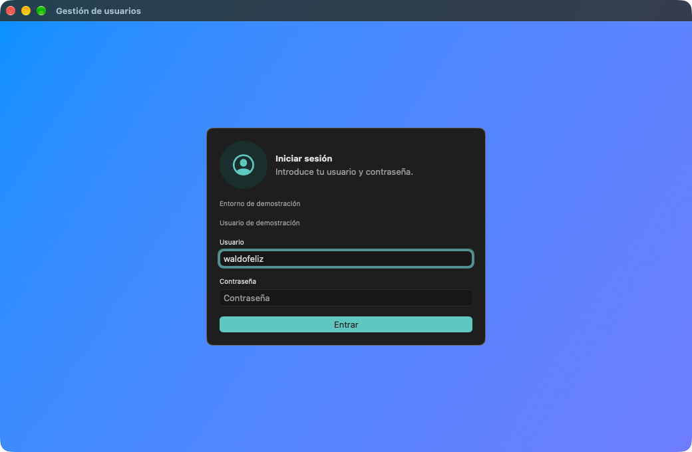
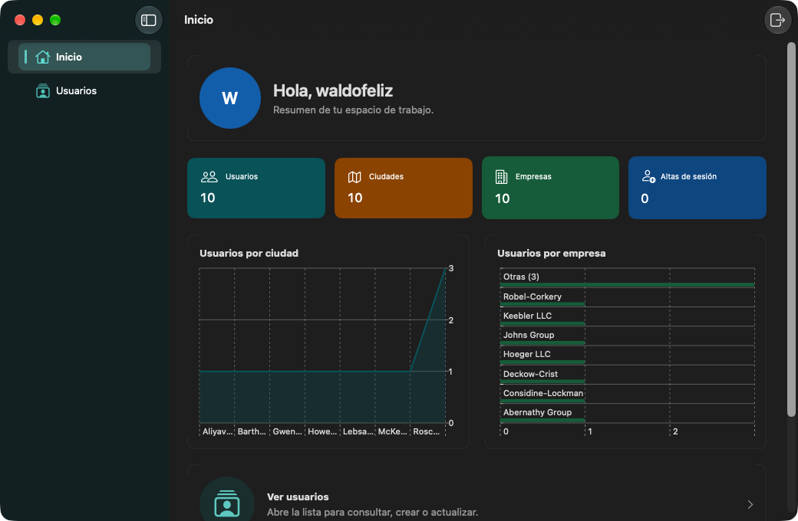
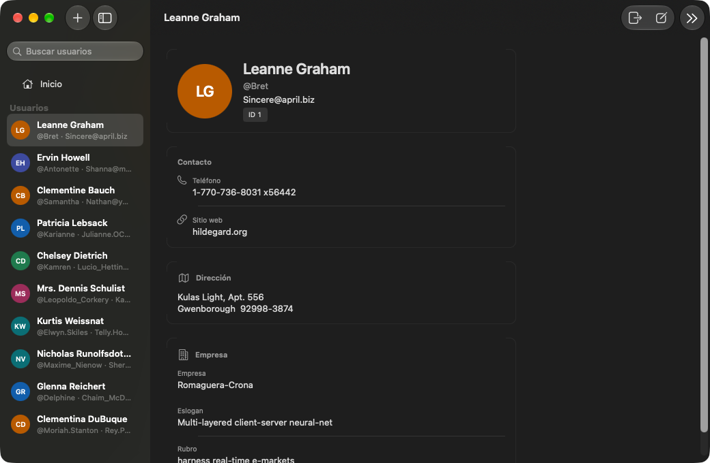
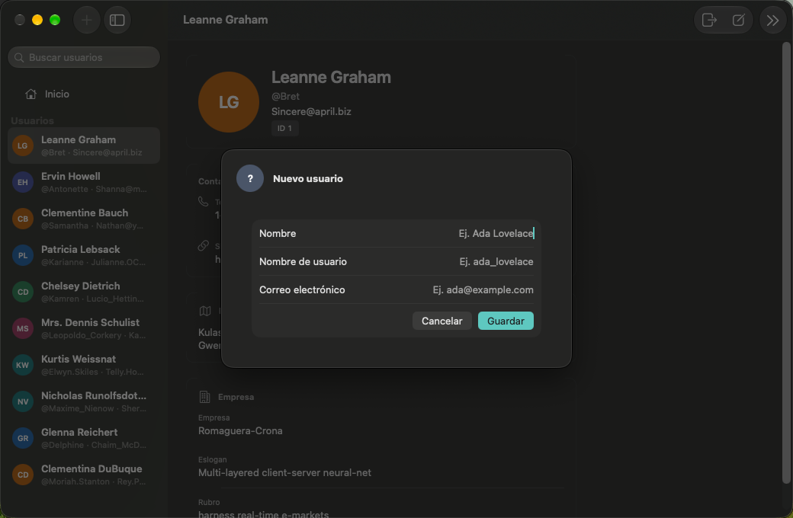

# Gestión de usuarios

App nativa **macOS** (Swift 5 / SwiftUI) para consultar, crear y actualizar un directorio de usuarios contra [JSONPlaceholder](https://jsonplaceholder.typicode.com). Tras un inicio de sesión de demostración se abre un panel **Inicio** (KPI y gráficos nativos) y el destino **Usuarios** (lista + detalle).

No es un producto de producción: la autenticación es local, la sesión vive en memoria y el remoto **no persiste** altas ni ediciones.

> **Entorno de demostración — no es producción.**  
> Credenciales de demo (solo para desarrollo y pruebas; la pantalla de login las anuncia como entorno de demostración, **no** las muestra en la UI):  
> Usuario: `waldofeliz`  
> Contraseña: `123456`  
> No reutilices este patrón (clave débil, un solo usuario, sin IdP) en un sistema real.

Repositorio: [https://github.com/waldofeliz/GestionUsuarios.git](https://github.com/waldofeliz/GestionUsuarios.git) · rama `main`.

## Capturas









## Requisitos

| Requisito | Versión / nota |
|-----------|----------------|
| Sistema | macOS 27 (deployment target `27.0`) |
| Xcode | 27 o posterior, con el SDK de macOS |
| Destino | **My Mac** (no iOS / iPad) |
| Red | HTTPS saliente a `jsonplaceholder.typicode.com` (App Sandbox con cliente de red) |
| Git | Para clonar y, si hace falta, revertir |

No hay CocoaPods, SPM de terceros ni Docker. No hay CI en el remoto.

## Abrir, compilar y ejecutar

### Con Xcode (recomendado para usar la app)

```bash
git clone https://github.com/waldofeliz/GestionUsuarios.git
cd GestionUsuarios
open GestionUsuarios.xcodeproj
```

1. Scheme **GestionUsuarios**, destino **My Mac**.
2. Product → Run (`⌘R`).
3. Debe aparecer la ventana **Gestión de usuarios** en **Iniciar sesión**.

Si `xcodebuild` no encuentra el scheme, abre el proyecto una vez en Xcode para que se genere.

### Con `xcodebuild`

Desde la raíz del repo:

```bash
xcodebuild -scheme GestionUsuarios -destination 'platform=macOS' build
```

Eso deja el producto en DerivedData de Xcode; para usarla a diario es más simple Run desde el IDE.

Listar schemes y destinos:

```bash
xcodebuild -list -project GestionUsuarios.xcodeproj
```

## Iniciar sesión (demo)

1. Arranca la app: ves **Iniciar sesión**, el subtítulo *Introduce tu usuario y contraseña* y el texto **Entorno de demostración**.
2. Usuario: `waldofeliz` (sensible a mayúsculas; se recortan espacios). Placeholder: *Ej. tu usuario* — no revela el nombre demo.
3. Contraseña: `123456` (no se recorta; no aparece en hints ni en VoiceOver).
4. **Entrar** (o Return). Si aciertas, oyes/ves *Sesión iniciada* y pasas a **Inicio**.

Errores habituales:

- Campos vacíos: *Escribe un usuario.* / *Escribe la contraseña.*
- Par incorrecto: un solo mensaje, *Usuario o contraseña incorrectos.*
- Demasiados intentos: bloqueo temporal (*Demasiados intentos. Espera N s.*).

La clave **no** se envía a JSONPlaceholder. Cerrar la app termina la sesión (no hay Keychain ni “recordarme”).

## Cómo usar la app

### Inicio

Tras el login, la barra lateral muestra **Inicio** (por defecto) y **Usuarios**. En Inicio:

- Saludo *Hola, waldofeliz* y *Resumen de tu espacio de trabajo.*
- Cuatro KPI derivados del listado real: **Usuarios**, **Ciudades**, **Empresas**, **Altas de sesión**.
- Gráfico de área **Usuarios por ciudad** y de barras **Usuarios por empresa** (Swift Charts; no hay “visitas” ni series temporales inventadas).
- Accesos **Ver usuarios** y **Nuevo usuario**.

Los números salen del mismo `GET /users` (más altas de esta sesión). Si la red falla y no hay lista, las KPI muestran *No disponible*, no un cero fingido.

### Usuarios (CRUD)

Elige **Usuarios** en la barra lateral (o **Ver usuarios** en Inicio):

| Acción | Cómo |
|--------|------|
| Ver detalle | Clic en una fila. Contacto, dirección y empresa si vienen en el dataset. |
| Buscar | Campo *Buscar usuarios* en la lista, o `⌘F`. Filtra por nombre, usuario y correo. |
| Recargar | Toolbar **Recargar** o `⌘R`. |
| Crear | **Nuevo usuario**, acceso de Inicio, o `⌘N`. Campos: nombre, nombre de usuario, correo. Guardar / Cancelar. |
| Editar | Con un usuario seleccionado: **Editar** o `⌘E`. `⌘S` guarda. |
| Atajos | `⌘I` ver detalle; Escape cancela el formulario. |

JSONPlaceholder responde 201/200 a POST/PUT, pero **un recargar posterior vuelve al dataset original** (unos 10 usuarios). Las altas y cambios de esta ejecución se mantienen en un overlay en RAM hasta **Cerrar sesión** o salir de la app.

### Cerrar sesión

- Botón de barra de herramientas **Cerrar sesión**, o menú **Cuenta → Cerrar sesión**.
- Vuelves a **Iniciar sesión** en la misma ventana; el overlay de usuarios se vacía.
- Si hay un formulario sucio, aparece *¿Descartar cambios?* (*Descartar* / *Seguir editando*). No hay un segundo diálogo de logout.

`⌘Q` cierra la aplicación; no es logout.

## Arquitectura (para desarrollo)

Capas Clean Architecture en un solo target de app. Decisiones canónicas (no duplicadas aquí):

| ADR | Tema |
|-----|------|
| [ADR-001](docs/adr/ADR-001-clean-architecture-usuarios.md) | Domain / Data / Presentation, JSONPlaceholder, overlay de sesión, App Sandbox |
| [ADR-002](docs/adr/ADR-002-autenticacion-demo-y-shell.md) | Login local, sesión en RAM, un `WindowGroup`, shell Inicio \| Usuarios, logout compuesto |
| [ADR-003](docs/adr/ADR-003-dashboard-graficos.md) | KPI y Swift Charts en Inicio; agregación en Domain; cero HTTP extra |

Índice de UX, seguridad y alcance de producto: [docs/README.md](docs/README.md). Runbook de máquina local: [docs/runbook-local.md](docs/runbook-local.md).

Estructura de código (orientativa):

```
GestionUsuarios/
  App/              Composition Root
  Domain/           Entidades y casos de uso (usuarios + auth)
  Data/             HTTP, DTO, overlay, verificador demo
  Presentation/     SwiftUI: login, shell, Inicio, Usuarios
```

## Tests

Unitarios / Swift Testing (comando canónico del proyecto):

```bash
xcodebuild test -scheme GestionUsuarios -destination 'platform=macOS' -only-testing:GestionUsuariosTests
```

Suite UI (XCTest; necesita GUI y hace login demo):

```bash
xcodebuild test -scheme GestionUsuarios -destination 'platform=macOS' -only-testing:GestionUsuariosUITests
```

Toda la batería:

```bash
xcodebuild test -scheme GestionUsuarios -destination 'platform=macOS'
```

No hay linter configurado en el repo.

## Límites conocidos

- Un único usuario de login; no hay OAuth, registro ni recuperación de clave.
- Sin base de datos local (no Core Data / SwiftData).
- Sin CI. Publicación = este repositorio GitHub, no App Store ni servidor.
- Dataset remoto de juguete; gráficos con n pequeño (a menudo ~1 usuario por ciudad/empresa). Eso es esperado.

## Changelog

Cambios versionados: [CHANGELOG.md](CHANGELOG.md).
