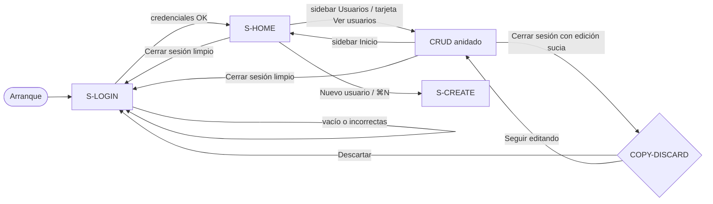

# UX / Accesibilidad — Login, Inicio y Cerrar sesión (macOS)

**Handoff origen**: EE-UX-20260919-3  
**Handoff destino**: UX-DEV-20260919-3  
**Owner**: `@ux-accessibility-agent`  
**Destino implementación**: `@senior-fullstack-developer-agent`  
**Fecha**: 2026-09-19  
**Plataforma**: macOS 27 · SwiftUI · **no iOS**  
**Idioma UI**: español (`es`)  
**Contratos previos (no se relajan)**:
- `docs/ux/navegacion-usuarios.md` — IA, menú CRUD, atajos, copy base, WCAG, identifiers de usuarios
- `docs/ux/design-system-usuarios.md` — tokens teal, avatares, tarjetas, wells, contraste AA
- `docs/adr/ADR-001-clean-architecture-usuarios.md` — capas Domain/Data/Presentation

**G10**: `CONDITIONAL` (`degraded: revisión manual WCAG`) hasta Accessibility Inspector post-implementación.

Este documento es el contrato de **sesión de demostración**, **dashboard Inicio** y **cierre de sesión**. No es código de producción.

---

## 1. Qué resuelve

Hoy la app abre directo en el CRUD de usuarios (`RaizUsuariosVista`). El producto pide un **gate de demostración** antes del trabajo:

1. Pantalla **Iniciar sesión**.
2. Tras éxito: **Inicio** (resumen + accesos), con sidebar de destinos **Inicio** y **Usuarios**.
3. **Usuarios** conserva el CRUD actual (lista + detalle + sheet + menú).
4. **Cerrar sesión** (menú + control visible) vuelve al login.

Flujo de producto: **Login → Inicio → Usuarios (CRUD) → Logout → Login**. Una sola `WindowGroup`.

**Fuera de alcance de esta spec**

- Código Swift de producción.
- AuthN real (OAuth, Keychain de producto, tokens, backend de cuentas, biometría).
- Mostrar la contraseña de demostración en la UI.
- `TabView`, `NavigationStack` raíz, patrón iPhone.
- Relajar identifiers, copy o WCAG de usuarios ya cerrados.
- Dashboard web tipo KPI (sparklines, grid 12 columnas, cards de métricas excesivas).

---

## 2. Enmiendas puntuales a contratos previos

Solo lectura: este documento **añade** pantallas y **ajusta** el shell. No reabre el CRUD.

| Contrato previo | Cambio |
|-----------------|--------|
| `navegacion-usuarios.md` §1 — Auth fuera de alcance | Auth de **demostración** entra en alcance UI. Sigue sin ser AuthN de API (JSONPlaceholder pública). |
| §2.2 — inventario arranca en `S-LIST` | Arranque = `S-LOGIN`. Tras éxito = `S-HOME` por defecto. `S-LIST`…`S-ERROR` viven bajo el destino **Usuarios**. |
| §2.3 — split raíz = lista + detalle | Split **raíz autenticado** = destinos (Inicio / Usuarios) + contenido. El split lista+detalle **se anida** solo en Usuarios. |
| §2.3 — ventana min 760×480 / default 960×640 | Autenticado: min **880×520**, default **1040×680** (cabe destino + lista + detalle). Login: se mantiene min 760×480. |
| NAV-07 — foco inicial = lista | Foco inicial de app = `login.usuario`. Tras login = encabezado de Inicio. |
| NAV-10 — título de ventana | Ver §8.4. |
| §4 comandos CRUD | **Deshabilitados** (visibles en gris) en `S-LOGIN`. Habilitados según reglas actuales una vez autenticado. |
| §7.1 WCAG 3.3.8 Auth accesible = N/A | **Aplica** en `S-LOGIN` (`A11Y-AUTH-*`). |
| `design-system-usuarios.md` §3.9 max ficha 560 | Inicio: columna **max 720**. Login: tarjeta **420** (mismo ancho que sheet crear). Destino Usuarios: 560 de ficha **sin cambio**. |
| DS «No: dashboard web KPI» | Inicio usa **2–3 tarjetas + hero**, no grid de métricas. |

Navegación, atajos, `listStyle(.sidebar)`, validación de usuario, identifiers `lista.*` / `detalle.*` / `form.*` / `toolbar.nuevo|recargar|editar` / `estado.*` **no se tocan**.

---

## 3. Credenciales de demostración (solo implementación / tests)

| Campo | Valor | ¿Visible en UI? |
|-------|-------|-----------------|
| Usuario | `waldofeliz` | No como chrome. El usuario lo escribe. El hint **no** lo revela. |
| Contraseña | `123456` | **Nunca.** Ni hint, ni placeholder, ni `help`, ni README in-app, ni VoiceOver, ni logs. |

**CRED-01** Comparación local, case-sensitive, trim solo en usuario (no en contraseña).  
**CRED-02** Un único mensaje de fallo de credenciales (no enumerar «usuario no existe» vs «contraseña mal»).  
**CRED-03** La clave **no** se persiste en UserDefaults, archivos, ni `os_log`. Tras logout, el `SecureField` queda vacío.  
**CRED-04** Documentar las credenciales en README de desarrollo o en UITests está permitido; **no** en copy `COPY-*` de producto.

Esto es un **gate de UI**, no un control de seguridad de la API. Superficie para `@security-specialist-agent` (secreto en binario): ver riesgos del handoff.

---

## 4. Arquitectura de información

### 4.1 Inventario de pantallas nuevas + existentes

| ID | Nombre UI | Contenedor | Cuándo |
|----|-----------|------------|--------|
| `S-LOGIN` | Iniciar sesión | Contenido completo de la ventana (sin sidebar de destinos) | App sin sesión |
| `S-HOME` | Inicio | Columna detalle del shell autenticado | Sesión OK y destino **Inicio** |
| `S-SHELL` | Shell autenticado | `NavigationSplitView` destinos + contenido | Sesión OK |
| `S-LIST` … `S-ERROR` | CRUD usuarios | **Anidados** en destino Usuarios | Sin cambio de contrato |

**Prohibido**: `TabView`; login en `.sheet` / `.fullScreenCover` estilo iOS; segunda `WindowGroup` para el CRUD; reemplazar el split interno de usuarios por `NavigationStack`.

### 4.2 Mapa espacial

**Sin sesión**

```
WindowGroup "Gestión de usuarios"   min 760×480   default 960×640
└── S-LOGIN  (tarjeta 420 centrada en el lienzo windowBackground)
```

**Con sesión**

```
WindowGroup   min 880×520   default 1040×680
└── NavigationSplitView (sidebar destinos + detalle)   style .balanced
    ├── Sidebar 180–220 pt (ideal 200)
    │   ├── Inicio     identifier shell.inicio
    │   └── Usuarios   identifier shell.usuarios
    └── Detalle
        ├── S-HOME                         si destino == .inicio
        └── RaizUsuariosVista (split actual)  si destino == .usuarios
            ├── Lista 220–320
            └── Detalle usuario min 400
└── sheet S-CREATE (420) — igual que hoy, presentado sobre el shell
└── toolbar.logout — una sola instancia a nivel de shell (Inicio y Usuarios)
```

**SHELL-01** Una sola ventana. Login no abre ventana nueva; logout no cierra la `WindowGroup`.  
**SHELL-02** Sidebar de destinos: `.listStyle(.sidebar)`, material de sistema, **no** color sólido custom.  
**SHELL-03** Destino por defecto tras login: **Inicio**.  
**SHELL-04** Seleccionar **Usuarios** monta el CRUD existente **sin** reimplementarlo. Identifiers de usuarios intactos.  
**SHELL-05** El split interno de usuarios (NAV-02: la lista no desaparece al ver detalle) **sigue vigente** dentro de Usuarios.  
**SHELL-06** Colapsar la sidebar de destinos usa el control nativo + `SidebarCommands()` ya presentes.  
**SHELL-07** No hay tercer ítem de sidebar en v1 (nada de Ajustes).

### 4.3 Flujo



### 4.4 Transiciones

| Acción | Origen | Destino | Notas |
|--------|--------|---------|-------|
| Arranque | — | `S-LOGIN` | No cargar lista aún (evita trabajo y anuncios de «N usuarios» detrás del login) |
| Entrar OK | `S-LOGIN` | `S-HOME` | Anuncio `COPY-LOGIN-OK`; iniciar `GET /users` en segundo plano para el total |
| Entrar KO | `S-LOGIN` | `S-LOGIN` | Ver §5.4 |
| Clic / Return en fila sidebar Inicio | Shell | `S-HOME` | Si hay edición sucia en Usuarios: `NAV-08` / `COPY-DISCARD` **antes** de cambiar destino |
| Clic Usuarios / tarjeta Ver usuarios | `S-HOME` | CRUD | Destino `.usuarios`; selección de usuario según estado conservado de la sesión autenticada |
| Tarjeta / botón Nuevo usuario en Inicio | `S-HOME` | sheet `S-CREATE` | Misma acción que `CMD-NEW`. Al guardar OK: destino **Usuarios** + `selection = nuevo.id` (igual que hoy) |
| Cerrar sesión, sin sucio | Shell | `S-LOGIN` | Sin alerta extra |
| Cerrar sesión, con sucio (`S-EDIT` o `S-CREATE`) | Shell | alerta `COPY-DISCARD` | Confirmar → logout; «Seguir editando» cancela el logout |
| ⌘W | Cualquiera | Cerrar ventana (sistema) | Si sucio: `COPY-DISCARD` **antes** (NAV ya lo pide). No es logout. |
| Logout | — | `S-LOGIN` | Campos de login vacíos; foco `login.usuario` |

**NAV-AUTH-01** Cambiar de Usuarios → Inicio con formulario sucio = misma barrera `NAV-08` que cambiar de fila.  
**NAV-AUTH-02** Logout con sucio **no** usa un copy distinto: reutiliza `COPY-DISCARD-*` (el riesgo es perder la edición, no «cerrar sesión» en abstracto).  
**NAV-AUTH-03** Tras logout, el estado de Presentation del CRUD (selección, búsqueda, modo edición, sheet, destinos) se **restablece**. El overlay Data de la sesión de proceso **no lo prescribe UX** (demo de un solo usuario; Architect/Security). La UI no debe mostrar datos de usuarios **mientras** `S-LOGIN` está visible.

---

## 5. `S-LOGIN` — receta

### 5.1 Layout

Lienzo: `windowBackgroundColor`. Una tarjeta opaca `DS-CARD` radio 10, stroke `DS-SEP` 0,5 pt (1 pt en Increase Contrast, igual que tarjetas de detalle).

```
VStack(alignment: .leading, spacing: 16) {
    HStack(spacing: 12) {
        Well 72  SYM-LOGIN (person.crop.circle)   // accessibilityHidden
        VStack(alignment: .leading, spacing: 4) {
            Text(COPY-LOGIN-T)     // headline, .isHeader, identifier login.titulo
            Text(COPY-LOGIN-B)     // body + secondary
        }
    }
    Text(COPY-LOGIN-HINT)          // caption + secondary, identifier login.hint
    Form grouped:
        Usuario     Secure? NO — TextField
        Contraseña  SecureField
        (errores de campo bajo cada uno, patrón ST-VAL-02)
    Status credenciales KO         // solo si aplica; identifier login.error
    Button COPY-LOGIN-ENTER        // borderedProminent, identifier login.entrar
}
.frame(width: 420)
.padding(20)
```

La tarjeta se **centra** en la ventana (gate de acceso, no ficha de inspector). Excepción consciente al «leading de detalle» del DS. No hero a todo el ancho, no video, no blur.

**LOGIN-01** Labels persistentes: el título del `TextField` / `SecureField` en el `Form` grouped **es** el label visible (`COPY-L-LOGIN-USER`, `COPY-L-LOGIN-PASS`). El placeholder **no** sustituye al label (A11Y-26).  
**LOGIN-02** Placeholder de usuario: `COPY-PH-LOGIN-USER` («Ej. tu usuario»). **Prohibido** `waldofeliz` o `123456` como placeholder.  
**LOGIN-03** Contraseña: **sin** placeholder que simule puntos o la clave. El label «Contraseña» basta.  
**LOGIN-04** Botón **Entrar** siempre habilitado (mismo criterio ST-VAL-01: el usuario descubre errores al enviar). Return / tecla de acción por defecto envía.  
**LOGIN-05** No hay «Mostrar contraseña». No hay enlace «¿Olvidaste…?».  
**LOGIN-06** Hint `COPY-LOGIN-HINT` = «Usuario de demostración». No concatena usuario ni clave.

### 5.2 Foco y teclado (⌘ no atrapa)

Orden de foco:

1. Usuario (`login.usuario`)  
2. Contraseña (`login.clave`)  
3. Entrar (`login.entrar`)  

Luego ciclo. El well y el hint no entran al ciclo (hint es texto estático).

| ID | Regla |
|----|--------|
| `A11Y-FOCUS-LOGIN` | Al aparecer `S-LOGIN` (arranque y post-logout): `defaultFocus` en `login.usuario`. |
| `A11Y-LOGIN-CMD` | Los campos **no** interceptan atajos de sistema: ⌘Q, ⌘H, ⌘M, ⌘W, ⌘,. No hay monitor global de teclas. No hay atajo de carácter suelto (2.1.4). |
| `A11Y-LOGIN-RET` | Return en usuario mueve a contraseña **o** envía si la clave ya tiene valor; Return en clave envía. Preferir: Return en cualquier campo = submit (HIG formulario corto). |
| `A11Y-LOGIN-ESC` | Esc en login **no** cierra la app ni borra campos. No hay sheet que cerrar. |
| `A11Y-LOGIN-TAB` | Tab / ⇧Tab recorre los 3 controles sin trampa (2.1.2). |
| `A11Y-LOGIN-PASTE` | Pegar en ambos campos está **permitido** (3.3.8). No bloquear el menú Editar → Pegar. |
| `A11Y-LOGIN-AUTOFILL` | `textContentType`: usuario `.username`; clave `.password`. Permite llavero (3.3.8). No desactivar Autofill. |

Comandos de app en login: ver §8.2 (deshabilitados, visibles).

### 5.3 VoiceOver / 4.1.2

- Título `COPY-LOGIN-T` con trait `.isHeader`.  
- `SecureField` nativo: VoiceOver anuncia el rol de texto seguro, **no** el valor en claro.  
- `accessibilityValue` de `login.clave`: **nunca** la contraseña en claro. Si hay error de campo, anunciar el mensaje de error, no el secreto.  
- `login.entrar`: nombre accesible contiene el texto visible «Entrar» (2.5.3).  
- Hint: texto visible; no hace falta identifier de botón.

### 5.4 Errores (icono + texto, no solo color)

Validar al pulsar Entrar. Tras el primer fallo, `onChange` en vivo como el form de usuarios.

| Condición | UI | Foco | Identifier |
|-----------|-----|------|------------|
| Usuario vacío / solo espacios | Bajo el campo: icono `exclamationmark.circle` + `COPY-VAL-LOGIN-USER`, `Color.red` sistema | `login.usuario` | el campo ya es `login.usuario` |
| Clave vacía | Igual + `COPY-VAL-LOGIN-PASS` | primer campo inválido | `login.clave` |
| Ambos llenos, no coinciden | Status **fuera** de un campo concreto: icono + `COPY-LOGIN-ERR`. No marcar usuario ni clave como «el incorrecto». Vaciar **solo** la clave. | `login.clave` | `login.error` |
| Éxito | El status desaparece | — | — |

**LOGIN-ERR-01** El status de credenciales usa el patrón visual del banner de recarga **simplificado** (icono + texto `primary`, no solo tinte rojo). Puede ser un `Label` callout bajo el form; no hace falta el crema `DS-BANNER-BG` (no es error de red).  
**LOGIN-ERR-02** Anuncio 4.1.3 al aparecer el error: el texto de `COPY-LOGIN-ERR` o el primer `COPY-VAL-LOGIN-*`.  
**LOGIN-ERR-03** No shake de ventana. No alert modal para credenciales KO (el status inline basta).  
**LOGIN-ERR-04** No borrar el usuario escrito si la clave falló.

### 5.5 Secreto y logs

| ID | Regla |
|----|--------|
| `UX-SEC-01` | Prohibido `print`, `os_log`, `Logger` o `accessibilityValue` con la clave en claro. |
| `UX-SEC-02` | Prohibido prefijar el `SecureField` con el valor demo. |
| `UX-SEC-03` | Debug de UITests puede **escribir** la clave en el campo vía XCTest; eso no es UI de producto. |

---

## 6. `S-HOME` — receta

Norte: Mail / Contactos, no Analytics. Hero + **tres** piezas (1 estado + 2 acciones). Ancho máximo **720**, `alignment: .leading`, padding horizontal 24 / vertical 20, gap 20. Fondo de columna: window background.

```
ScrollView {
  VStack(alignment: .leading, spacing: 20) {
    Hero
    Tarjeta resumen (no es botón)
    Tarjeta «Ver usuarios» (botón)
    Tarjeta «Nuevo usuario» (botón)
  }
  .frame(maxWidth: 720, alignment: .leading)
  .padding(24h, 20v)
}
```

No cuarta tarjeta KPI. No gráficos. No tabla embebida de usuarios (eso es el destino Usuarios).

### 6.1 Hero

```
HStack(alignment: .center, spacing: 16) {
    Avatar 80×80   nombre = usuario de sesión, nombreUsuario = mismo
                   // hidden; reutiliza AvatarUsuarioVista
    VStack(alignment: .leading, spacing: 4) {
        Text(COPY-HOME-HELLO)  // title semibold, identifier home.saludo, .isHeader
        Text(COPY-HOME-SUB)    // body + secondary
    }
}
.padding(16)
.frame(maxWidth: .infinity, alignment: .leading)
.background(DS-CARD)  // mismo estiloTarjetaUsuarios
```

`COPY-HOME-HELLO` = «Hola, {usuario}» con el username de sesión (`waldofeliz` tras login OK). El nombre accesible del hero es ese texto (el avatar no se anuncia). Identifier contenedor: `home.hero`.

### 6.2 Tarjeta resumen (total)

Well 72 `person.2` + título `COPY-HOME-TOTAL-T` («Usuarios») + valor:

| Estado de lista | Valor visible | Identifier |
|-----------------|---------------|------------|
| Cargando, sin cache | `COPY-HOME-TOTAL-LOAD` («Contando usuarios…») + `ProgressView` small con label | `home.total` |
| OK | `COPY-COUNT` ya existente (`{n} usuarios` / `1 usuario` / `0 usuarios`) | `home.total` |
| Error de red, sin cache | `COPY-HOME-TOTAL-NA` («No se pudo obtener el total.»). **No** mostrar «0 usuarios» | `home.total` |
| Error con cache | Mostrar el conteo cacheado (la verdad de sesión) | `home.total` |

**HOME-01** Vacío ≠ error (ST-03): 0 usuarios es un total válido.  
**HOME-02** Esta tarjeta **no** es `Button`. VoiceOver: texto, no «botón».  
**HOME-03** No duplicar el banner de recarga de la lista. El error de red se trabaja en Usuarios (`estado.error.*`).

### 6.3 Tarjetas de acceso (acciones)

Cada una es un **`Button`** de tarjeta completa (hit target ≫ 24 pt), estilo tarjeta DS, contenido:

```
HStack(alignment: .center, spacing: 16) {
    Well 72  (SYM-PEOPLE o SYM-NEW)
    VStack(alignment: .leading, spacing: 4) {
        Text(título)  // headline
        Text(cuerpo)  // body + secondary
    }
    Spacer()
    Image(systemName: "chevron.forward")  // secondary, hidden a11y
}
.padding(16)
```

| Tarjeta | Título | Cuerpo | Symbol well | Identifier | Acción |
|---------|--------|--------|-------------|------------|--------|
| Ver usuarios | `COPY-HOME-LIST-T` | `COPY-HOME-LIST-B` | `person.crop.rectangle.stack` | `home.verLista` | Destino Usuarios |
| Nuevo usuario | `COPY-HOME-NEW-T` | `COPY-HOME-NEW-B` | `plus` | `home.nuevo` | `abrirAlta()` (sheet 420) |

Nombre accesible = título visible (2.5.3). Hint opcional = cuerpo. El chevron es decorativo.

**HOME-04** `home.nuevo` **no** sustituye a `toolbar.nuevo`: son controles distintos. Al abrir el sheet, el formulario sigue usando `form.nombre` (el UITest existente debe **autenticarse** antes; ver §11).  
**HOME-05** En Inicio **no** se pinta una segunda toolbar de Nuevo/Recargar de lista (evita identifiers duplicados). Recargar sigue en menú Visualización (⌘R) y, en destino Usuarios, en `toolbar.recargar`.

### 6.4 Carga de datos para el total

Tras login OK, disparar la misma carga inicial que hoy hace `RaizUsuariosVista.task`. Si el usuario entra a Usuarios antes de que termine, no lanzar un segundo GET paralelo innecesario (reutilizar el modelo).

VoiceOver: no anunciar «N usuarios cargados» en Inicio **y** otra vez al abrir Usuarios. Un solo anuncio 4.1.3 por carga (`COPY-LOADED`), preferible al completar, sin importar el destino visible.

---

## 7. Cerrar sesión

### 7.1 Dos superficies obligatorias

| Superficie | Copy | Identifier | Atajo |
|------------|------|------------|-------|
| Toolbar del shell autenticado | `COPY-LOGOUT` + SF `rectangle.portrait.and.arrow.right` | `toolbar.logout` | ninguno |
| Menú **Cuenta** | `COPY-LOGOUT` | `menu.logout` | ninguno |

**LOGOUT-01** Una sola instancia de `toolbar.logout` (nivel shell). No añadir el botón dentro de `ListaUsuariosVista` ni del detalle.  
**LOGOUT-02** Icon-only de toolbar **permitido** si hay `accessibilityLabel` = `COPY-LOGOUT` y `help` = `COPY-LOGOUT-HELP` (mismo patrón que Nuevo/Recargar). El menú muestra texto.  
**LOGOUT-03** **Sin atajo.** No usurpar ⌘Q. **Prohibido** ⇧⌘Q (cierra sesión de macOS).  
**LOGOUT-04** En `S-LOGIN` el ítem de menú permanece visible y **deshabilitado** (CMD-01). El botón de toolbar **no existe** (no hay shell).  
**LOGOUT-05** Nombre accesible contiene «Cerrar sesión» (2.5.3).

### 7.2 Menú Cuenta

```
CommandMenu(COPY-MENU-ACCOUNT) {    // "Cuenta"
    Button(COPY-LOGOUT) { … }       // identifier menu.logout
        .disabled(!sesionActiva)
}
```

No mezclar con Archivo: Archivo ya tiene Nuevo usuario, Guardar y Cerrar (ventana).

### 7.3 Confirmación

| Estado | Comportamiento |
|--------|----------------|
| Sin edición sucia y sin sheet sucio | Logout inmediato |
| `S-EDIT` sucio o `S-CREATE` sucio | Alerta existente `COPY-DISCARD-*`. «Descartar» ejecuta logout; «Seguir editando» cancela |

No inventar un segundo diálogo «¿Cerrar sesión?».

Tras logout: `S-LOGIN`, campos vacíos, sin residual de `login.error`, foco usuario, título de ventana `COPY-APP`.

---

## 8. Shell, menú y títulos

### 8.1 Sidebar de destinos

Cada fila:

- Inicio: `Label(COPY-SHELL-INICIO, systemImage: "house")`, identifier `shell.inicio`  
- Usuarios: `Label(COPY-SHELL-USUARIOS, systemImage: "person.crop.rectangle.stack")`, identifier `shell.usuarios`

Selección nativa del `List` (no pintar acento a mano). `accessibilityAddTraits` de header **no** en cada fila; opcional sección «Espacio» no hace falta (solo 2 ítems).

Ancho columna destinos: min 180, ideal 200, max 220.

Teclado: ↑↓ entre destinos. El split interno de usuarios sigue con su propio ciclo cuando ese destino está activo.

**SHELL-A11Y-01** VoiceOver anuncia «Inicio, seleccionado» / «Usuarios», no el nombre SF (`house`).  
**SHELL-A11Y-02** Identifier de la lista de destinos: `shell.sidebar`.

### 8.2 Comandos — matriz de habilitación

Los `CMD-*` de `navegacion-usuarios.md` §4 se conservan. Añadir `CMD-LOGOUT`. En login, `FocusedValue` de `modeloUsuarios` no está (o la sesión es nil) → CRUD ya sale disabled.

| ID | Login | Inicio | Usuarios (lectura) | Usuarios (edición/alta) |
|----|-------|--------|--------------------|-------------------------|
| `CMD-NEW` ⌘N | off | **on** | on si no hay sheet | off si sheet (regla actual `puedeNuevo`) |
| `CMD-SAVE` ⌘S | off | off | off | on (regla actual) |
| `CMD-EDIT` ⌘E | off | off | on si hay selección | on según actual |
| `CMD-DETAIL` ⌘I | off | off | on si hay selección | actual |
| `CMD-RELOAD` ⌘R | off | **on** (refresca total + lista) | actual | actual |
| `CMD-FIND` ⌘F | off | off (no hay search de inicio) | on (enfoca búsqueda de lista) | actual |
| `CMD-LOGOUT` | off | on | on | on (con `NAV-AUTH-02` si sucio) |
| `SidebarCommands` | opcional (no hay sidebar) | on | on | on |

**CMD-AUTH-01** En Inicio, ⌘N abre el sheet sobre Inicio (no obliga a cambiar de destino antes).  
**CMD-AUTH-02** En Inicio, ⌘F no «traga» el atajo: ítem Buscar deshabilitado (gris), el sistema no debe quedar sin respuesta.  
**CMD-AUTH-03** `menu.logout` es el identifier del `Button` del menú, no del `CommandMenu`.

### 8.3 Toolbar autenticada

| Destino | Ítems | Identifiers |
|---------|-------|-------------|
| Inicio | Solo **Cerrar sesión** (shell) | `toolbar.logout` |
| Usuarios | Nuevo + Recargar (lista, existentes) + Editar/Guardar/Cancelar (detalle, existentes) + **Cerrar sesión** (shell) | sin cambiar los de usuarios; logout no se duplica |

### 8.4 Título de ventana (enmienda NAV-10)

| Estado | Título |
|--------|--------|
| Login | `Gestión de usuarios` |
| Inicio | `Inicio — Gestión de usuarios` |
| Usuarios, sin selección | `Gestión de usuarios` (igual que hoy) |
| Usuarios, con selección | `{name} — Gestión de usuarios` (igual que hoy) |

---

## 9. Tokens, símbolos y contraste

Reutilizar `TemaUsuarios` / `AvatarUsuarioVista` / `SimboloWellUsuarios` / `estiloTarjetaUsuarios`. **No** nuevos hex.

| Pieza | Token |
|-------|--------|
| Texto | `Color.primary` / `secondary` |
| Tarjetas login/home | `DS-CARD` + stroke DS |
| Wells | fill `#E6F3F3` / `#1A2E2D`, glifo `DS-ACCENT` (receta empty del DS) |
| Entrar / Guardar | `.borderedProminent` + `tintaEtiquetaProminent` (A11Y-C-07) |
| Error de campo | `Color.red` + `exclamationmark.circle` |
| Avatar sesión | paleta 8 colores, iniciales de `waldofeliz` → **W** |

Columna Inicio: `frame(maxWidth: 720)`. Login: 420. No sombra > 8 pt.

### 9.1 Catálogo SF Symbols (aditivo)

| ID | Symbol | Dónde | A11y |
|----|--------|-------|------|
| `SYM-LOGIN` | `person.crop.circle` | well login | hidden |
| `SYM-HOME` | `house` | fila sidebar Inicio | el Label nombra |
| `SYM-PEOPLE` | `person.crop.rectangle.stack` | fila Usuarios + tarjeta Ver usuarios | el Label nombra |
| `SYM-COUNT` | `person.2` | well resumen | hidden |
| `SYM-NEW` | `plus` | tarjeta Nuevo + toolbar existente | label `COPY-NEW` / título de tarjeta |
| `SYM-LOGOUT` | `rectangle.portrait.and.arrow.right` | toolbar / menú | label `COPY-LOGOUT` |
| `SYM-CHEVRON` | `chevron.forward` | tarjetas de acceso | hidden |
| `SYM-VAL` | `exclamationmark.circle` | errores de campo login | hidden; el campo anuncia |

**Prohibido**: `globe`; `lock.fill` como único mensaje de error (el texto nombra); symbols `.palette` multicolor.

Dark / Increase Contrast / Reduce Transparency / Reduce Motion: mismas reglas DS §8. Login y Home son opacos → Reduce Transparency cubierto.

---

## 10. WCAG 2.2 — delta de sesión

Sigue vigente el mapa §7 de `navegacion-usuarios.md`. Cambios y altas:

| WCAG | Nivel | Delta | ID |
|------|-------|-------|-----|
| 3.3.8 Auth accesible | AA | Antes N/A. Login **no** bloquea pegar ni Autofill. No reto cognitivo extra (captcha, copiar clave de un canvas). No pedir transcribir un código de unispace | `A11Y-AUTH-01` |
| 3.3.2 Etiquetas | A | Labels persistentes en login | `A11Y-AUTH-02` |
| 3.3.1 / 3.3.3 Errores | A/AA | Icono+texto; mensaje genérico de credenciales; sugerencia en vacíos | `A11Y-AUTH-03` |
| 2.5.3 Label in name | A | Entrar, Cerrar sesión, Inicio, Usuarios | `A11Y-AUTH-04` |
| 2.1.1 / 2.1.2 Teclado | A | Ciclo login 3 controles; ⌘ no atrapado; Esc no trampa | `A11Y-AUTH-05` |
| 2.4.7 Foco visible | AA | Anillo de sistema; no `focusEffect(.hidden)` | `A11Y-AUTH-06` |
| 2.4.11 Foco no oscurecido | AA | Status de error empuja el layout; no overlay absoluto sobre el campo | `A11Y-AUTH-07` |
| 1.4.1 Color | A | Error de login no solo rojo | `A11Y-AUTH-08` |
| 1.4.3 Contraste | AA | Tokens DS; Entrar Dark: no blanco sobre `#5EC8C0` | `A11Y-AUTH-09` |
| 4.1.2 Nombre, rol, valor | A | Identifiers §11; SecureField nativo | `A11Y-AUTH-10` |
| 4.1.3 Status | AA | Anuncio de error de login y de «Sesión iniciada» | `A11Y-AUTH-11` |
| 2.2.1 Tiempo | A | **Sigue** sin timeout de sesión (A11Y-31). El gate demo no expira solo | `A11Y-AUTH-12` |
| 3.1.1 Idioma | A | Todo el chrome nuevo en español | `A11Y-AUTH-13` |
| 2.4.2 Título | A | NAV-10 enmendado §8.4 | `A11Y-AUTH-14` |

No aplica: captcha, 2FA, SMS.

---

## 11. Identifiers (contrato QA)

### 11.1 Invariantes — no renombrar

`lista.busqueda`, `lista.usuario.{id}`, `lista.titulo`, `toolbar.nuevo`, `toolbar.recargar`, `toolbar.editar`, `detalle.vacio`, `detalle.id`, `detalle.nombre`, `detalle.username`, `detalle.email`, `detalle.telefono`, `detalle.sitioWeb`, `detalle.direccion`, `detalle.empresa`, `form.nombre`, `form.username`, `form.email`, `form.guardar`, `form.cancelar`, `estado.cargando`, `estado.listaVacia`, `estado.busquedaVacia`, `estado.error.reintentar`, `estado.error.banner`.

### 11.2 Nuevos (obligatorios)

| Identifier | Elemento |
|------------|----------|
| `login.titulo` | Encabezado «Iniciar sesión» |
| `login.hint` | Texto «Usuario de demostración» |
| `login.usuario` | Campo usuario |
| `login.clave` | Campo contraseña |
| `login.entrar` | Botón Entrar |
| `login.error` | Status de credenciales incorrectas (ausente si no hay error) |
| `home.hero` | Contenedor hero |
| `home.saludo` | Texto «Hola, {usuario}» |
| `home.total` | Valor / estado del total |
| `home.verLista` | Tarjeta-botón Ver usuarios |
| `home.nuevo` | Tarjeta-botón Nuevo usuario |
| `shell.sidebar` | Lista de destinos |
| `shell.inicio` | Fila Inicio |
| `shell.usuarios` | Fila Usuarios |
| `toolbar.logout` | Botón toolbar Cerrar sesión |
| `menu.logout` | Ítem de menú Cerrar sesión |

No identifier en wells ni avatares (hidden). No `login.password` (usar `login.clave`). No duplicar `toolbar.nuevo` en Inicio.

### 11.3 Impacto UITests

`testToolbarNuevoAbreFormularioNombre` **fallará** el día 1 si no hay login previo: `toolbar.nuevo` ya no está al `launch()`.

Contrato: helper de autenticación (UITest) que:

1. Espera `login.usuario`.  
2. Escribe `waldofeliz`.  
3. Escribe la clave en `login.clave`.  
4. Pulsa `login.entrar`.  
5. Espera `home.saludo` o `shell.usuarios`.  
6. Recién entonces pulsa `toolbar.nuevo` / `home.nuevo`.

Developer implementa el helper o actualiza el test existente; no dejar el test verde «saltándose» el login.

---

## 12. Catálogo de copy (español, cerrado)

Developer no improvisa. Tono COPY-01 / COPY-02 (tuteo neutro, sin “Oops”, sin inglés de chrome).

| ID | Contexto | String |
|----|----------|--------|
| `COPY-LOGIN-T` | Título login | Iniciar sesión |
| `COPY-LOGIN-B` | Subtítulo login | Introduce tu usuario y contraseña. |
| `COPY-LOGIN-HINT` | Hint | Usuario de demostración |
| `COPY-L-LOGIN-USER` | Label | Usuario |
| `COPY-L-LOGIN-PASS` | Label | Contraseña |
| `COPY-PH-LOGIN-USER` | Placeholder usuario | Ej. tu usuario |
| `COPY-LOGIN-ENTER` | Botón | Entrar |
| `COPY-LOGIN-ERR` | Status KO | Usuario o contraseña incorrectos. |
| `COPY-VAL-LOGIN-USER` | Validación | Escribe un usuario. |
| `COPY-VAL-LOGIN-PASS` | Validación | Escribe la contraseña. |
| `COPY-LOGIN-OK` | Anuncio VO | Sesión iniciada |
| `COPY-SHELL-INICIO` | Sidebar / título | Inicio |
| `COPY-SHELL-USUARIOS` | Sidebar | Usuarios |
| `COPY-HOME-HELLO` | Hero | `Hola, {usuario}` |
| `COPY-HOME-SUB` | Hero | Resumen de tu espacio de trabajo. |
| `COPY-HOME-TOTAL-T` | Tarjeta resumen | Usuarios |
| `COPY-HOME-TOTAL-LOAD` | Total cargando | Contando usuarios… |
| `COPY-HOME-TOTAL-NA` | Total error | No se pudo obtener el total. |
| `COPY-HOME-LIST-T` | Tarjeta | Ver usuarios |
| `COPY-HOME-LIST-B` | Tarjeta | Abre la lista para consultar, crear o actualizar. |
| `COPY-HOME-NEW-T` | Tarjeta | Nuevo usuario |
| `COPY-HOME-NEW-B` | Tarjeta | Crea un usuario en un formulario. |
| `COPY-LOGOUT` | Menú / toolbar | Cerrar sesión |
| `COPY-LOGOUT-HELP` | help toolbar | Cerrar la sesión y volver al inicio de sesión |
| `COPY-MENU-ACCOUNT` | CommandMenu | Cuenta |
| `COPY-WINDOW-HOME` | Título ventana | `Inicio — Gestión de usuarios` |

Reutilizar sin duplicar: `COPY-APP`, `COPY-NEW`, `COPY-COUNT`, `COPY-LOADED`, `COPY-DISCARD-*`, `COPY-SIDEBAR` (= «Usuarios», mismo string que `COPY-SHELL-USUARIOS`).

**Prohibido en copy de producto**: `123456`, `password`, `Login`, `Sign in`, `Logout`, `Submit`, `Username` como título (el label es «Usuario»).

---

## 13. Checklist a11y verificable para Developer

Se **suma** a `navegacion-usuarios.md` §9 y `design-system-usuarios.md` §8. Full Keyboard Access ON. Accessibility Inspector en Light, Dark e Increase Contrast.

### Teclado

- [ ] `A11Y-K-L01` Arranque: foco en `login.usuario`; Tab → clave → Entrar → ciclo, sin trampa
- [ ] `A11Y-K-L02` Return envía el login; Esc no cierra la app
- [ ] `A11Y-K-L03` ⌘Q / ⌘W / ⌘, funcionan en login (⌘ no atrapa)
- [ ] `A11Y-K-L04` ⌘N / ⌘E / ⌘I / ⌘R / ⌘F deshabilitados en login (visibles en gris)
- [ ] `A11Y-K-L05` Login OK → destino Inicio; ⌘N abre sheet; al guardar, Usuarios + detalle
- [ ] `A11Y-K-L06` Sidebar: ↑↓ Inicio/Usuarios; Usuarios muestra lista con `lista.usuario.{id}`
- [ ] `A11Y-K-L07` `toolbar.logout` y `menu.logout` cierran sesión; foco vuelve a `login.usuario`
- [ ] `A11Y-K-L08` Logout con edición sucia presenta `COPY-DISCARD`; cancelar deja el form
- [ ] `A11Y-K-L09` Pegar funciona en usuario y clave

### VoiceOver

- [ ] `A11Y-V-L01` Campos anuncian «Usuario» / «Contraseña», no solo placeholder
- [ ] `A11Y-V-L02` Clave no se lee en claro
- [ ] `A11Y-V-L03` Error KO se anuncia; foco a clave
- [ ] `A11Y-V-L04` Tras OK: «Sesión iniciada»; hero «Hola, waldofeliz»
- [ ] `A11Y-V-L05` Destinos: «Inicio», «Usuarios», no «house»
- [ ] `A11Y-V-L06` Toolbar logout: «Cerrar sesión», no el nombre del SF Symbol
- [ ] `A11Y-V-L07` `home.total` no es botón; `home.verLista` y `home.nuevo` sí

### Contraste / visual

- [ ] `A11Y-C-L01` Light/Dark: texto de hint y secundaria ≥ 4,5:1 **o** promocionar a `primary`
- [ ] `A11Y-C-L02` Entrar prominent en Dark: no blanco sobre `#5EC8C0` (A11Y-C-07)
- [ ] `A11Y-C-L03` Error login = icono + texto
- [ ] `A11Y-C-L04` Increase Contrast: stroke de tarjetas login/home visible
- [ ] `A11Y-C-L05` Hint **no** contiene `123456` ni la clave en captura

### Flujo / identifiers

- [ ] `A11Y-F-L01` Identifiers §11.2 presentes
- [ ] `A11Y-F-L02` Identifiers §11.1 intactos tras login + destino Usuarios
- [ ] `A11Y-F-L03` Usuario vacío → `COPY-VAL-LOGIN-USER` + foco usuario
- [ ] `A11Y-F-L04` Clave incorrecta → `COPY-LOGIN-ERR` en `login.error`; clave vaciada; usuario conservado
- [ ] `A11Y-F-L05` UITest de alta pasa **después** de autenticar
- [ ] `A11Y-L-L01` Menú **Cuenta** en español; UI en español

**Bloqueantes G10 (FAIL si uno falta)**: `A11Y-K-L01`, `A11Y-K-L03`, `A11Y-K-L07`, `A11Y-V-L01`, `A11Y-V-L02`, `A11Y-C-L03`, `A11Y-C-L05`, `A11Y-F-L02`, `A11Y-F-L04`, más los bloqueantes ya vigentes del CRUD (`A11Y-K-01`, `A11Y-K-07`, `A11Y-V-02`, `A11Y-V-03`, `A11Y-C-03`, `A11Y-F-01`, `A11Y-L-01`, `NAV-02`, `CMD-01`).

**No bloqueantes (CONDITIONAL)**: anuncio único `COPY-LOADED`, chevron hidden, total en recarga con cache, Increase Contrast fino de wells de Inicio.

---

## 14. Hallazgos sobre el estado actual (evidencia)

| Sev. | Hallazgo | Evidencia | WCAG | Remediación (esta spec) |
|------|----------|-----------|------|-------------------------|
| High (producto) | No hay gate de sesión; CRUD al arrancar | `GestionUsuariosApp.swift` monta `RaizUsuariosVista` | 3.3.8 ahora aplica; IA de producto | `S-LOGIN` → shell |
| High (regresión QA) | UITest asume `toolbar.nuevo` al launch | `GestionUsuariosUITests.swift` `testToolbarNuevoAbreFormularioNombre` | — | Helper de login §11.3 |
| Medium | 3.3.8 marcado N/A en navegación | `navegacion-usuarios.md` §7.1 | 3.3.8 | Este documento lo activa |
| Low | Ventana 760 pt no cabe destino + lista + detalle | min actual 760×480 | 1.4.10 | min autenticado 880×520 |
| Info | Threat model: Auth N/A, M1 N/A | `docs/security/threat-model-usuarios.md` | — | Handoff a Security (secreto demo en binario); UX no finge AuthN |

Teclado, labels y menú del CRUD **no se reabren**: siguen siendo el contrato. Esta spec no introduce trampas de foco ni iconos de toolbar huérfanos.

---

## 15. Gate G10 — verdict

### 15.1 Esta entrega (spec, sin código de producción)

| Gate | Status | Evidencia | Notas |
|------|--------|-----------|-------|
| G0 Context | PASS | Handoff EE-UX-20260919-3 | Swift 5 / SwiftUI / macOS 27; ADR-001; DS teal; identifiers vigentes |
| G10 Accessibility | CONDITIONAL | `degraded: revisión manual WCAG` — criterios mapeados §10–§13; contrastes **heredados** de tokens ya calculados en `design-system-usuarios.md` §3; **no** hay captura de Accessibility Inspector ni axe (no aplica a AppKit). Inspector no ejecutado sobre UI de login (aún no existe). | Máximo en degradado: **CONDITIONAL** |

PASS real de G10 solo tras implementar + Inspector Light/Dark/IC + checklist §13 bloqueantes + UITests con login.

### 15.2 Previsto tras implementación

- **PASS** si: login operable por teclado; clave nunca en claro; identifiers §11; CRUD invariante verde; `A11Y-C-L03` + `A11Y-C-L05`; logout menú+toolbar.  
- **CONDITIONAL** si: bloqueantes OK pero faltan no bloqueantes o no hay captura Inspector (`degraded`).  
- **FAIL** si: `TabView`; clave visible en UI/hint; se pierde un identifier de usuarios; error de login solo por color; ⌘ atrapado en campos; logout solo en menú **o** solo en toolbar.

**Backlog tooling** (no bloquea): UITest de login KO + logout; guía Inspector en README; CI. **Backlog Security**: secreto demo embebido (no es remedición UX).

---

## 16. Handoff hacia Developer

## Handoff: @ux-accessibility-agent → @senior-fullstack-developer-agent
**Handoff-ID**: UX-DEV-20260919-3  
**Prioridad**: P0

### Contexto detectado
- Stack: Swift 5 / SwiftUI / macOS 27 (NO iOS)
- Arquitectura: ADR-001 Clean Architecture (Domain/Data/Presentation). Gate de login es **UI de demostración**, no AuthN de API. NO cambiar contratos Domain/Data salvo que Architect lo pida.
- DB/ORM: JSONPlaceholder REST + overlay `UsuarioRepositorioSesion`
- Build: `xcodebuild -scheme GestionUsuarios -destination 'platform=macOS'`
- Test: Swift Testing + XCTest UI. Identifiers de usuarios **deben conservarse**. UITests actuales asumen CRUD al launch → hay que autenticar antes.
- Lint: no detectado
- CI: no detectado
- Constraints: App Sandbox; HIG macOS; español; menú `.commands` existente + menú **Cuenta**; WCAG 2.2 A/AA; DS `docs/ux/design-system-usuarios.md`; navegación `docs/ux/navegacion-usuarios.md`; misma ventana; no TabView; no mostrar clave `123456` en UI; G10 CONDITIONAL degradado Inspector

### Alcance
- **Incluye**: `S-LOGIN`, shell autenticado con sidebar **Inicio** / **Usuarios**, `S-HOME` (hero + 3 tarjetas), logout toolbar + menú Cuenta, copy `COPY-*` de §12, identifiers §11.2, confirmación de logout sucio reutilizando `COPY-DISCARD`, actualizar UITests para login previo, reutilizar `TemaUsuarios` / avatares / wells / tarjetas
- **Excluye**: código fuera de Presentation/App/UITests; OAuth/Keychain de producto; mostrar la clave en UI; TabView; NavigationStack raíz; rehacer el CRUD; iconos bitmap; iOS; timeout de sesión; toggle «mostrar contraseña»; dashboard KPI
- **Archivos afectados** (orientativos; Presentation/App):
  - `GestionUsuarios/App/GestionUsuariosApp.swift` — raíz login vs shell
  - `GestionUsuarios/Presentation/Usuarios/RaizUsuariosVista.swift` — anidar bajo destino Usuarios; **no** romper sheet/toolbar existentes
  - `GestionUsuarios/Presentation/Comandos/ComandosUsuarios.swift` — habilitación según sesión; `CommandMenu` Cuenta + `menu.logout`
  - `GestionUsuarios/Presentation/Navegacion/TextosUsuarios.swift` — copy + `IdentificadorAccesibilidad` nuevos
  - **Nuevo** vistas login / inicio / shell (nombres a criterio Developer, capa Presentation)
  - `GestionUsuariosUITests/GestionUsuariosUITests.swift` — autenticar antes de `toolbar.nuevo`
  - No Domain/Data salvo composición mínima de «sesión UI» en App/Presentation

### Artefactos entregados
- `docs/ux/login-home-logout.md` (IA, recetas, WCAG, copy, identifiers, G10, este handoff)

### Decisiones tomadas
| Decisión | Justificación | Alternativa descartada |
|----------|---------------|------------------------|
| Login a pantalla completa en la misma ventana, no sheet | Gate de acceso HIG; el sheet 420 ya significa «Nuevo usuario» | Sheet/modal de login (compite con alta; patrón iOS) |
| Sidebar de 2 destinos + CRUD anidado | Petición «Inicio y Usuarios»; conserva NAV-02 e identifiers | TabView; 3 columnas nativas (aprieta 760 pt y reescribe el split actual) |
| Inicio = hero + total + 2 acciones, max 720 | DS prohíbe dashboard KPI; 2–4 tarjetas pedidas → 3 piezas + hero | Grid de métricas; tabla embebida |
| Hint «Usuario de demostración» sin usuario ni clave | Handoff EE; 3.3.8 no exige revelar el secreto | Placeholder `waldofeliz` / `123456` |
| Error de credenciales genérico + vaciar solo clave | 3.3.1 sin enumeración de cuentas; 1.4.1 icono+texto | Alert modal; «usuario no existe» |
| Menú **Cuenta** + `toolbar.logout`, sin atajo | Visible por teclado y ratón; no choca con ⌘Q / ⇧⌘Q | Solo menú Archivo; atajo ⇧⌘Q (sistema) |
| Logout sucio reutiliza `COPY-DISCARD` | Handoff: confirmar si edición sucia; un solo diálogo conocido | Segundo copy «¿Cerrar sesión?» |
| Autofill username/password permitido | WCAG 3.3.8 | `textContentType` nil que impide el llavero |
| G10 CONDITIONAL | Inspector no ejecutado; quality-gates degradado | PASS sin evidencia de runtime |

### Riesgos abiertos
| Riesgo | Severidad | Requiere validación de |
|--------|-----------|------------------------|
| Secreto demo en el binario (`123456`) | Alta (producto demo) | `@security-specialist-agent` — no es bloqueo UX |
| UITest `testToolbarNuevoAbreFormularioNombre` rojo hasta el helper de login | Alta | Developer + QA |
| Split anidado: doble sidebar en ventana estrecha | Media | Min 880 pt; SidebarCommands; Inspector reflow |
| `toolbar.logout` duplicado si también se pone en lista | Alta (identifiers) | Una instancia en el shell |
| VoiceOver lee la clave si se usa `TextField` en vez de `SecureField` | Alta | Usar `SecureField` nativo |
| `borderedProminent` Entrar en Dark (blanco sobre teal) | Media | `tintaEtiquetaProminent` + Inspector |
| Overlay Data visible tras re-login | Baja | Fuera de UX; Architect/Security |
| Threat model aún dice Auth N/A | Baja | Actualizar en pase Security |

### Criterio de éxito
- [ ] Arranque = `S-LOGIN` con `login.usuario` / `login.clave` / `login.entrar`
- [ ] Clave **nunca** visible en UI, hint ni logs de producto
- [ ] Login OK → Inicio (hero + total + Ver usuarios + Nuevo usuario), sidebar Inicio/Usuarios
- [ ] Destino Usuarios = CRUD actual; identifiers §11.1 verdes
- [ ] Logout menú + toolbar; sucio → `COPY-DISCARD`; vuelve a login con foco usuario
- [ ] Copy §12 exacto; UI en español
- [ ] UITests: login + `toolbar.nuevo` abre `form.nombre`
- [ ] Build `xcodebuild` macOS verde
- [ ] Light + Dark: sin blanco sobre `#5EC8C0`; error login con icono+texto

### Gates pendientes
| Gate | Esperado |
|------|----------|
| G10 | CONDITIONAL (Inspector) o PASS con checklist §13 bloqueantes |
| G2 | Tras código: `xcodebuild` build sin errores |
| G6 | UITests con autenticación + identifiers invariantes |
| G3 | Review post-implementación |
| G4 | Security: secreto demo + logs (no bloquea este handoff UX) |
| G1 | SKIP UX (no hay ADR nuevo). Architect si el split anidado exige enmienda ADR-001 |

### Comandos de verificación
- Build: `xcodebuild -scheme GestionUsuarios -destination 'platform=macOS' build`
- Test: `xcodebuild -scheme GestionUsuarios -destination 'platform=macOS' test`
- Lint: no detectado
- A11y: Accessibility Inspector → Audit + Contrast en Light, Dark e Increase Contrast sobre Login, Inicio y Usuarios (manual; `degraded`)

---

## Referencias

- `docs/ux/navegacion-usuarios.md` — IA CRUD, menú, WCAG base, copy, identifiers
- `docs/ux/design-system-usuarios.md` — tokens teal, avatares, tarjetas, wells
- `docs/adr/ADR-001-clean-architecture-usuarios.md` — capas (login demo en Presentation/App)
- `docs/security/threat-model-usuarios.md` — Auth aún N/A; actualizar en pase Security
- Apple HIG — macOS (ventanas, sidebars, toolbars, menús, campos seguros)
- WCAG 2.2 §3.3.8, §3.3.1, §3.3.2, §2.1.1, §2.1.2, §1.4.1, §1.4.3, §2.5.3, §4.1.2, §4.1.3
- AgentesAI quality-gates G10
