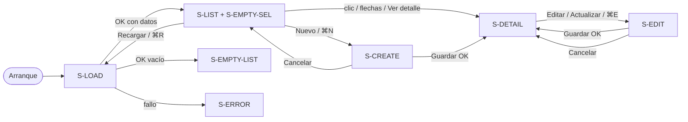

# UX / Accesibilidad — Gestión de usuarios (macOS)

**Handoff origen**: EE-UX-20260919-1  
**Owner**: `@ux-accessibility-agent`  
**Destino**: `@senior-fullstack-developer-agent`  
**Fecha**: 2026-09-19  
**Plataforma**: macOS 27 · SwiftUI · **no iOS**  
**Idioma UI**: español (`es`)  
**G10 (previsto post-implementación)**: `CONDITIONAL` hasta evidencia de Accessibility Inspector (ver §10)

Este documento es el contrato de IA, navegación, copy y a11y. No sustituye implementación; el código debe cumplir cada ID verificable (`NAV-*`, `CMD-*`, `ST-*`, `A11Y-*`, `COPY-*`).

---

## 1. Qué resuelve

App de escritorio para consultar, crear, actualizar y ver el detalle de usuarios contra JSONPlaceholder (`GET/POST/PUT /users`). Debe sentirse nativa de macOS: ventana redimensionable, barra de menús del sistema, atajos Command, sidebar + detalle, teclado y VoiceOver.

**Fuera de alcance de esta spec (no implementar aquí)**

- Código Swift de producción completo
- Iconos custom (usar SF Symbols)
- `TabView` / patrones iPhone
- Autenticación, impresión, settings window, iCloud

---

## 2. Arquitectura de información

### 2.1 Objetos de dominio visibles

| Objeto | Campos en UI | Origen API |
|--------|----------------|------------|
| Usuario (fila de lista) | `name`, `username`, `email` | `GET /users` |
| Usuario (detalle lectura) | `id`, `name`, `username`, `email` | Recurso seleccionado (lista o `GET /users/{id}` si se recarga detalle) |
| Usuario (formulario crear/editar) | `name`, `username`, `email` (editables) | `POST /users` / `PUT /users/{id}` |

Campos JSONPlaceholder no expuestos en v1 (`address`, `phone`, `website`, `company`): no mostrar, no editar. Backlog, no scope.

### 2.2 Inventario de pantallas (rutas lógicas)

No hay URLs. Las “rutas” son **estados de escena** en una sola `WindowGroup`.

| ID | Nombre UI | Contenedor | Cuándo |
|----|-----------|------------|--------|
| `S-LIST` | Lista de usuarios | Columna sidebar de `NavigationSplitView` | Siempre visible si `columnVisibility != .detailOnly` |
| `S-EMPTY-SEL` | Sin selección | Columna detalle | `selection == nil` y no hay sheet de crear |
| `S-DETAIL` | Detalle de usuario | Columna detalle | `selection != nil` y modo `.lectura` |
| `S-EDIT` | Editar usuario | Columna detalle (mismo lugar que `S-DETAIL`) | `selection != nil` y modo `.edicion` |
| `S-CREATE` | Nuevo usuario | `.sheet` modal de ventana | Acción Crear / ⌘N |
| `S-LOAD` | Cargando lista | Overlay/reemplazo de contenido de `S-LIST` | Primera carga o recarga |
| `S-EMPTY-LIST` | Lista vacía | Contenido de `S-LIST` | 200 OK y `users.isEmpty` y búsqueda vacía |
| `S-EMPTY-SEARCH` | Sin coincidencias | Contenido de `S-LIST` | Búsqueda no vacía y filtro 0 resultados |
| `S-ERROR` | Error de red | Banner persistente **más** contenido de lista (si hay cache) o `ContentUnavailableView` si no hay datos | Fallo de red/HTTP |

**Prohibido**: apilar `NavigationStack` como raíz; empujar “Detalle” como push estilo iPhone; pestañas inferiores.

### 2.3 Mapa espacial (una ventana)

```
WindowGroup "Gestión de usuarios"   min 760×480   default 960×640
└── NavigationSplitView (sidebar + detalle)
    ├── Sidebar 220–320 pt (min 220, ideal 260)
    │   ├── Título de sección: "Usuarios"
    │   ├── Campo de búsqueda (placement: sidebar)
    │   ├── Lista (selection: Usuario.ID?)
    │   └── Estados S-LOAD / S-EMPTY-LIST / S-EMPTY-SEARCH / S-ERROR
    └── Detalle (min 400 pt)
        ├── S-EMPTY-SEL  si selection == nil
        ├── S-DETAIL     si modo .lectura
        └── S-EDIT       si modo .edicion
└── sheet S-CREATE (ancho 420, no pantalla completa)
```

### 2.4 Flujo de pantallas



### 2.5 Transiciones (contrato)

| Acción del usuario | Estado origen | Estado destino | Selección |
|--------------------|---------------|----------------|-----------|
| Clic en fila / ↑↓ + espacio/return | `S-LIST` | `S-DETAIL` | `id` de la fila |
| Menú **Ver detalle** (⌘I) | Cualquiera con selección | `S-DETAIL` (sale de `.edicion` **solo si** no hay cambios sucios; si hay, ver `NAV-08`) | se mantiene |
| Menú **Crear** / ⌘N | Cualquiera | `S-CREATE` sheet | lista no cambia |
| Guardar crear OK | `S-CREATE` | cierra sheet → `S-DETAIL` del usuario nuevo (id devuelto por API, p.ej. 11) | `selection = nuevo.id` |
| Cancelar crear | `S-CREATE` | cierra sheet; vuelve al estado previo | se mantiene |
| Menú **Actualizar** / ⌘E | `S-DETAIL` o lista con selección | `S-EDIT` | se mantiene |
| Guardar editar OK | `S-EDIT` | `S-DETAIL` con datos nuevos | se mantiene |
| Cancelar editar sin cambios | `S-EDIT` | `S-DETAIL` | se mantiene |
| Cancelar editar con cambios | `S-EDIT` | diálogo de confirmación (`COPY-DISCARD`) | se mantiene |
| Recargar / ⌘R | Cualquiera salvo sheet/diálogo abierto | `S-LOAD` luego lista | intentar conservar `selection` si el id sigue existiendo; si no → `nil` |
| Cerrar sheet con Esc | `S-CREATE` | igual que Cancelar | — |

**NAV-01** Una sola ventana principal. No abrir detalle en `WindowGroup` adicional.  
**NAV-02** La lista nunca desaparece al ver detalle (salvo el usuario colapse el sidebar con el control nativo).  
**NAV-03** Crear es **sheet**, no reemplaza el detalle: el usuario sigue viendo contexto de la lista.  
**NAV-04** Editar es **in-place** en la columna detalle (mismo usuario, mismos campos, botones Guardar/Cancelar). Motivo: memoria espacial de escritorio; el id visible no “salta” a un modal.  
**NAV-05** `NavigationStack` anidado en detalle: **prohibido** en v1.  
**NAV-06** Sidebar colapsable con el comportamiento de sistema (`NavigationSplitView` + comando Ver barra lateral). Atajo de sistema permitido; no reinventar.  
**NAV-07** Foco inicial al abrir la app: campo de búsqueda **no**; la lista (si hay datos) o el botón **Reintentar** si `S-ERROR` sin cache.  
**NAV-08** Si `S-EDIT` tiene cambios sucios y el usuario selecciona otra fila, ⌘I, o Recargar: presentar `COPY-DISCARD`; no cambiar selección hasta confirmar o guardar.

---

## 3. Patrón de navegación: `NavigationSplitView` (decisión)

| Opción | Encaje macOS | Veredicto |
|--------|--------------|-----------|
| **A. `NavigationSplitView` sidebar + detalle** | Patrón Mail / Notas / Ajustes del Sistema: lista persistente, detalle amplio, teclado ↑↓, toolbar por columna | **Elegida** |
| B. `NavigationStack` raíz | Push/pop de iPhone; pierde la lista al entrar a detalle; no usa el ancho de escritorio | Descartada como raíz |
| C. `TabView` | HIG iOS; en macOS queda como pestañas de ventana poco idiomáticas para un único objeto (Usuario) | Fuera de alcance / prohibida |

**Justificación (escritorio)**

1. El usuario compara filas y lee un registro a la vez: master-detail es el modelo mental de apps de datos en Mac.
2. El menú **Ver detalle** no necesita “navegar a otra pantalla”: enfoca la columna detalle y anuncia el nombre.
3. Ancho típico ≥ 960 pt: dos columnas sin crowding; `NavigationStack` desperdicia la columna izquierda.
4. SwiftUI en macOS 14+ (aquí 27) da `columnVisibility`, `navigationSplitViewColumnWidth` y `focusedValue` para habilitar comandos según selección.

**Anchos**

| Columna | Min | Ideal | Max |
|---------|-----|-------|-----|
| Sidebar | 220 | 260 | 320 |
| Detalle | 400 | flexible | — |
| Ventana | 760×480 | 960×640 | libre |

**NAV-09** `navigationSplitViewStyle(.balanced)` (o default de macOS). No usar `.prominentDetail` de iPad.  
**NAV-10** Título de ventana: sin selección → `Gestión de usuarios`; con selección → `Nombre — Gestión de usuarios` (el nombre es `user.name`).  
**NAV-11** Toolbar:  
- Sidebar: `plus` (**Nuevo usuario**), `arrow.clockwise` (**Recargar**).  
- Detalle lectura: `square.and.pencil` (**Editar**).  
- Detalle edición: **Guardar** (botón de acción principal) + **Cancelar**.  
Todos con `Label` texto+icono o `help` + `accessibilityLabel` (nunca icono huérfano).

---

## 4. Menú principal macOS (`commands`)

La barra de menús es **obligatoria** además de la navegación in-app. Implementar en el `Scene` (`WindowGroup.commands`), no como menú hamburguesa.

### 4.1 Mapa de comandos

| ID | Menú | Ítem | Atajo | Habilitado cuando | Acción |
|----|------|------|-------|-------------------|--------|
| `CMD-NEW` | Archivo | Nuevo usuario | ⌘N | Sheet crear **no** presentado | Abre `S-CREATE` |
| `CMD-SAVE` | Archivo | Guardar | ⌘S | `S-EDIT` o `S-CREATE` visible | Dispara validación + submit del formulario activo |
| `CMD-CLOSE` | Archivo | Cerrar | ⌘W | Siempre (sistema) | Cierra ventana; si hay sucio, `COPY-DISCARD` antes |
| `CMD-EDIT` | Editar (grupo app, **después** de Pegar) | Actualizar usuario | ⌘E | `selection != nil` y no está en `S-CREATE` | Entra `S-EDIT` |
| `CMD-DETAIL` | Visualización | Ver detalle | ⌘I | `selection != nil` | Garantiza sidebar visible + foco al encabezado de detalle + modo `.lectura` (con `NAV-08` si sucio) |
| `CMD-RELOAD` | Visualización | Recargar | ⌘R | No hay sheet/diálogo bloqueante | `GET /users` |
| `CMD-SIDEBAR` | Visualización | Mostrar/ocultar barra lateral | ⌃⌘S | Siempre | Toggle `columnVisibility` nativo si el sistema no lo inserta |

**No duplicar** Deshacer/Cortar/Copiar/Pegar/Seleccionar todo: dejar grupos de sistema.  
**No** añadir Imprimir.  
**No** usurpar ⌘Q, ⌘H, ⌘M, ⌘W, ⌘, (coma).

### 4.2 `CommandGroup` SwiftUI (contrato de API, no código completo)

| Grupo | Uso |
|-------|-----|
| `CommandGroup(replacing: .newItem)` | `CMD-NEW` — el ítem por defecto “Nuevo” debe desaparecer |
| `CommandGroup(replacing: .saveItem)` o `after: .newItem` | `CMD-SAVE` con `.disabled` fuera de formularios |
| `CommandGroup(after: .pasteboard)` | `CMD-EDIT` |
| `CommandGroup(after: .toolbar)` o `CommandMenu("Visualización")` | `CMD-DETAIL`, `CMD-RELOAD` |
| `SidebarCommands()` | Incluir para `CMD-SIDEBAR` de sistema |

**CMD-01** Los ítems deshabilitados no se ocultan: se ven en gris (HIG).  
**CMD-02** El estado de habilitación sale de `FocusedValue` / `FocusedBinding` de la selección y del modo de formulario — no de un singleton opaco.  
**CMD-03** ⌘N no debe crear un documento/`WindowGroup` extra.  
**CMD-04** Atajos de un carácter (⌘E, ⌘R, ⌘I, ⌘N, ⌘S) no se activan cuando el foco está en un campo **solo si** el modificador Command está presente (WCAG 2.1.4 cumplido: no hay atajos de tecla suelta).  
**CMD-05** Copy de menú exacto: «Nuevo usuario», «Guardar», «Actualizar usuario», «Ver detalle», «Recargar». Sin puntos suspensivos salvo que abran un diálogo **antes** de actuar. «Nuevo usuario» **sin** «…» porque abre sheet de la propia acción. «Actualizar usuario» sin «…».

### 4.3 Atajos en lista (además del menú)

| Tecla | Contexto | Acción |
|-------|----------|--------|
| ↑ / ↓ | Lista enfocada | Cambia `selection` (List nativa) |
| Return / Espacio | Fila enfocada, modo lectura | Equivale a Ver detalle (foco al detalle) |
| Esc | `S-EDIT` | Cancelar (con `NAV-08` si sucio) |
| Esc | `S-CREATE` | Cancelar sheet |
| Tab / ⇧Tab | Formulario | Orden de foco §7.3 |

---

## 5. Componentes por pantalla (contenido exacto)

### 5.1 `S-LIST` — Lista

Cada fila muestra **dos líneas**:

- Primaria: `name` (cuerpo, `primary`)
- Secundaria: `@username · email` (`.secondary`, una línea, truncado al final)

**A11y de fila**: un solo elemento combinado.

- `accessibilityLabel`: `"{name}, {username}, {email}"`
- `accessibilityIdentifier`: `lista.usuario.{id}`
- Trait: botón **no**; es fila de lista (el `List` nativo basta)

Cabecera de sección visible: **Usuarios** (`accessibilityAddTraits: .isHeader`).

Contador en pie de sidebar o subtítulo: **"{n} usuarios"** / **"1 usuario"** (`COPY-COUNT`). VoiceOver: no anunciar en cada tecla de búsqueda; anunciar al **terminar** filtro (debounce 300 ms) con `AccessibilityNotification.Announcement`.

### 5.2 `S-EMPTY-SEL`

Icono SF `person.crop.rectangle.stack` + título + cuerpo (copy §8). Sin botón primario (el alta vive en sidebar/menú). Foco: el contenedor con label del título.

### 5.3 `S-DETAIL`

Estructura `Form` de solo lectura o `LabeledContent`:

| Label visible | Valor | Identificador |
|---------------|-------|---------------|
| Identificador | `id` (texto, no editable) | `detalle.id` |
| Nombre | `name` | `detalle.nombre` |
| Nombre de usuario | `username` | `detalle.username` |
| Correo electrónico | `email` | `detalle.email` |

Encabezado: `name` como título de navegación de la columna (`.navigationTitle`).  
Toolbar: **Editar**.

Email en lectura: `textSelection(.enabled)`; no abrir Mail.app al clic (evita salto de contexto). VoiceOver lee el valor, no “enlace” salvo que se decida lo contrario en v2.

### 5.4 `S-EDIT` y `S-CREATE` — Formulario

| Campo | Label persistente (nunca solo placeholder) | Placeholder de ayuda | Identificador | Autofill / teclado |
|-------|--------------------------------------------|----------------------|---------------|--------------------|
| Nombre | Nombre | Ej. Ada Lovelace | `form.nombre` | `name` / texto |
| Nombre de usuario | Nombre de usuario | Ej. ada_lovelace | `form.username` | `username` |
| Correo electrónico | Correo electrónico | Ej. ada@example.com | `form.email` | `emailAddress` |

Botones:

| Botón | Rol | Identificador | Atajo |
|-------|-----|---------------|-------|
| Guardar | Default action (Return en macOS form si está habilitado) | `form.guardar` | ⌘S |
| Cancelar | Cancel | `form.cancelar` | Esc |

**S-CREATE** título de sheet: **Nuevo usuario**.  
**S-EDIT** título de columna: **Editar — {name}**.

Campos de una sola columna, `Form` estilo agrupado de macOS (no stacked iOS compact). Ancho de sheet crear: 420 pt, altura intrínseca, no full-screen cover.

### 5.5 Búsqueda

`.searchable(text:placement: .sidebar, prompt: "Buscar usuarios")`  
Filtra en cliente por `name`, `username`, `email` (contains, case-insensitive, diéresis-insensitive).  
Identificador: `lista.busqueda`.  
Atajo: el campo es alcanzable por Tab; **no** robar ⌘F si el sistema lo asocia al find de la ventana — si se implementa Buscar, usar ⌘F **solo** para enfocar este campo (`CMD-FIND` opcional v1: **sí, implementar**: Visualización o Editar → **Buscar** ⌘F enfoca el search de sidebar).

---

## 6. Estados de UI (loading, vacío, error, validación)

### 6.1 Loading — `ST-LOAD`

| Regla | Detalle |
|-------|---------|
| Primera carga (sin cache) | `ProgressView` + texto **Cargando usuarios…** centrado en sidebar. Detalle permanece `S-EMPTY-SEL`. |
| Recarga con datos previos | No vaciar la lista. Overlay lineal o `progressView` en toolbar + `accessibilityLabel` **Recargando usuarios**. |
| Duración | Sin timeout de UI propio; el error de red lo define la capa de red. |
| VoiceOver | Al iniciar: anuncio **Cargando usuarios**. Al terminar OK: **{n} usuarios cargados**. |
| Identificador | `estado.cargando` |

**ST-01** Nunca un spinner que gire sin label.  
**ST-02** No bloquear menú Recargar con un modal de progreso.

### 6.2 Vacío — `ST-EMPTY`

**Lista vacía (API 200, 0 ítems, query vacía)**

- Título: **No hay usuarios**
- Cuerpo: **Crea un usuario para empezar. También puedes recargar por si la lista cambió.**
- Acciones: **Nuevo usuario** (principal), **Recargar** (secundaria)
- Identificador: `estado.listaVacia`

**Búsqueda sin resultados**

- Título: **Sin resultados**
- Cuerpo: **Ningún usuario coincide con «{query}».**
- Acción: **Limpiar búsqueda**
- Identificador: `estado.busquedaVacia`
- **No** ofrecer Crear aquí como único camino (sí puede existir en toolbar).

**ST-03** Vacío ≠ error. Paleta y copy distintos.

### 6.3 Error de red — `ST-ERROR`

| Condición | UI |
|-----------|----|
| Sin datos locales | `ContentUnavailableView` en sidebar: icono `wifi.exclamationmark`, copy de error, botón **Reintentar** (`estado.error.reintentar`) |
| Con datos locales (recarga fallida) | Banner no modal encima de la lista: **No se pudo actualizar la lista.** + **Reintentar**. La lista sigue operable. Identificador `estado.error.banner` |

Copy de error (elegir **una** frase según tipo, no stack trace):

| Causa | Título | Cuerpo |
|-------|--------|--------|
| Sin conexión / timeout | **Sin conexión** | **Comprueba tu red e inténtalo de nuevo.** |
| HTTP 4xx/5xx / JSON inválido | **No se pudo cargar** | **El servicio no respondió correctamente. Inténtalo de nuevo.** |

**ST-04** El error de **guardar** formulario no usa este banner de lista: usa alerta o mensaje al pie del form (`ST-SAVE-FAIL`).  
**ST-05** Reintentar mueve el foco al mismo control tras el intento (no al tope de la ventana).  
**ST-06** `role`/anuncio: `AccessibilityNotification.Announcement` con el título del error al aparecer. Banner con `accessibilityAddTraits: .updatesFrequently` **no**; es un status (WCAG 4.1.3).

**ST-SAVE-FAIL** (POST/PUT): alerta `NSAlert` SwiftUI `.alert`: título **No se pudo guardar**, cuerpo **El usuario no se registró. Inténtalo de nuevo.**, botones **Reintentar** / **Cerrar**. El formulario **conserva** valores.

JSONPlaceholder no persiste POST/PUT: tras 201/200 mostrar el usuario en lista/detalle igual (éxito de sesión). No mostrar disclaimer técnico en UI; opcional en README.

### 6.4 Validación de formulario — `ST-VAL`

Validar al **Guardar** y, después del primer intento fallido, en `onChange` de cada campo (inline).

| Campo | Reglas (en orden; mostrar la primera que falle) | Mensaje (`COPY-VAL-*`) |
|-------|--------------------------------------------------|-------------------------|
| Nombre | No vacío / no solo espacios | **Escribe un nombre.** |
| Nombre | Tras trim, longitud 2…80 | **El nombre debe tener entre 2 y 80 caracteres.** |
| Username | No vacío / no solo espacios | **Escribe un nombre de usuario.** |
| Username | Tras trim: `^[A-Za-z0-9_]{3,20}$` | **Usa 3 a 20 caracteres: letras, números o guion bajo.** |
| Username | Único en la lista cargada (crear: todos; editar: todos salvo el id actual). Comparación case-insensitive | **Ese nombre de usuario ya existe.** |
| Email | No vacío / no solo espacios | **Escribe un correo electrónico.** |
| Email | Patrón: un `@`, dominio con punto, sin espacios. Regex v1: `^[^@\s]+@[^@\s]+\.[^@\s]+$` | **Escribe un correo válido, como nombre@dominio.com.** |
| Email | Único en la lista cargada (misma regla que username, case-insensitive) | **Ese correo ya está en uso.** |

**ST-VAL-01** `form.guardar` se mantiene **habilitado** (HIG: el usuario debe poder descubrir errores). Al fallar: foco al **primer** campo inválido + anuncio del mensaje.  
**ST-VAL-02** Mensaje de error **visible** bajo el campo, color `Color.red` **del sistema** (adapta Dark Mode) **y** no solo por color: prefijo de icono `exclamationmark.circle` + texto.  
**ST-VAL-03** Relación label–error: el `TextField` debe exponer el error a VoiceOver (`accessibilityValue` incluye el error, o `accessibilityHint`, y `accessibilityIdentifier` estable). Ejemplo de nombre anunciado: **Nombre, Escribe un nombre, inválido**.  
**ST-VAL-04** No borrar el valor inválido.  
**ST-VAL-05** Trim al enviar, no mientras se escribe (excepto no bloquear espacios intermedios en `name`).  
**ST-VAL-06** Username y email en crear: unicidad solo contra lista en memoria (API fake). Suficiente para UX v1.

---

## 7. Requisitos WCAG 2.2 A/AA (macOS / SwiftUI)

ARIA web **no aplica**. Equivalente: atributos de accesibilidad de SwiftUI + HIG macOS + VoiceOver. Verificación: **Accessibility Inspector** (Xcode) + teclado + modo oscuro. No hay axe en este repo → G10 en modo degradado hasta evidencia.

### 7.1 Criterios aplicables y contrato de código

| WCAG | Nivel | Aplica | Qué debe hacer el código | ID |
|------|-------|--------|---------------------------|-----|
| 1.1.1 Contenido no textual | A | Sí | Todo SF Symbol de toolbar/menú/estado con `accessibilityLabel` en español. Decorative: `.accessibilityHidden(true)` | `A11Y-01` |
| 1.3.1 Info y relaciones | A | Sí | `Form` + labels visibles; errores ligados al campo; encabezados `.isHeader` en «Usuarios» y título de detalle | `A11Y-02` |
| 1.3.2 Secuencia significativa | A | Sí | Orden visual = orden de foco: búsqueda → lista → detalle/form | `A11Y-03` |
| 1.3.3 Características sensoriales | A | Sí | No indicar “el botón rojo” / “a la derecha” como única instrucción | `A11Y-04` |
| 1.3.5 Identificar el propósito | AA | Sí | `textContentType` / `SubmitLabel` en email y username | `A11Y-05` |
| 1.4.1 Uso del color | A | Sí | Error no solo rojo: icono + texto. Selección de lista: no solo color (fila seleccionada nativa) | `A11Y-06` |
| 1.4.3 Contraste de texto | AA | Sí | Texto ≥ 4,5:1. Usar `Color.primary` / `secondary` / `Color.accentColor` del sistema. **Prohibido** grises fijos `#999` sobre blanco | `A11Y-07` |
| 1.4.4 Redimensionar texto | AA | Sí | Fuentes `.body` / `.headline` del sistema (Dynamic Type). No truncar labels de form | `A11Y-08` |
| 1.4.10 Reflujo | AA | Parcial | Ventana min 760 pt; sidebar no cubre el formulario; al colapsar sidebar el detalle sigue usable | `A11Y-09` |
| 1.4.11 Contraste no textual | AA | Sí | Iconos de toolbar y foco ≥ 3:1 contra fondo. Usar controles nativos | `A11Y-10` |
| 1.4.13 Contenido hover/foco | AA | Sí | Tooltips (`help`) no bloquean; desaparecen con Esc | `A11Y-11` |
| 2.1.1 Teclado | A | Sí | Todas las acciones de §4 y §5 operables sin ratón | `A11Y-12` |
| 2.1.2 Sin trampa de teclado | A | Sí | Sheet y alertas cierran con Esc; Tab no se queda en un control invisible | `A11Y-13` |
| 2.1.4 Atajos de tecla de carácter | A | Sí | Solo atajos con Command; ninguno con tecla suelta | `A11Y-14` |
| 2.4.2 Titulado de páginas | A | Sí | Título de ventana §NAV-10 | `A11Y-15` |
| 2.4.3 Orden de foco | A | Sí | §7.3 | `A11Y-16` |
| 2.4.6 Encabezados y etiquetas | AA | Sí | Labels de form descriptivos; no “Campo 1” | `A11Y-17` |
| 2.4.7 Foco visible | AA | Sí | Anillo de foco de sistema; no `focusEffect(.hidden)` ni `focusable(false)` en controles operables | `A11Y-18` |
| 2.4.11 Foco no oscurecido (mín.) | AA | Sí | Banner de error no cubre el campo enfocado; sheet no deja foco en controles de detrás | `A11Y-19` |
| 2.5.3 Etiqueta en el nombre | A | Sí | El nombre accesible **contiene** el texto visible del botón/menú | `A11Y-20` |
| 2.5.8 Tamaño del objetivo (mín.) | AA | Sí | Controles custom ≥ 24×24 pt; preferir `Button` nativo / toolbar item | `A11Y-21` |
| 3.1.1 Idioma de la página | A | Sí | UI `es`. `String Catalog` o literales españoles. `CFBundleDevelopmentRegion` / localization `es` | `A11Y-22` |
| 3.2.1 Al recibir el foco | A | Sí | Enfocar una fila **no** abre sheet ni dispara red salvo el GET de detalle si se modela aparte | `A11Y-23` |
| 3.2.2 Al recibir entradas | A | Sí | Cambiar un TextField no envía POST | `A11Y-24` |
| 3.3.1 Identificación de errores | A | Sí | Texto de error por campo §6.4 | `A11Y-25` |
| 3.3.2 Etiquetas o instrucciones | A | Sí | Label visible siempre; placeholder no sustituye label | `A11Y-26` |
| 3.3.3 Sugerencia de error | AA | Sí | Mensajes de §6.4 son sugerencias (formato, longitud) | `A11Y-27` |
| 3.3.4 Prevención de errores | AA | N/A (no es transacción legal/financiera) | — | — |
| 3.3.7 Entrada redundante | A | Sí | Editar prefilla name/username/email; no pedir de nuevo el id | `A11Y-28` |
| 3.3.8 Auth accesible | AA | N/A | No hay login | — |
| 4.1.2 Nombre, rol, valor | A | Sí | Controles nativos; identificadores de §5; `ProgressView` con label | `A11Y-29` |
| 4.1.3 Mensajes de estado | AA | Sí | Carga, error, «{n} usuarios cargados», validación: anuncios, no solo visual | `A11Y-30` |
| 2.2.1 / 2.2.2 Tiempo | A | Sí | Sin límite de tiempo de sesión ni carruseles | `A11Y-31` |
| 2.5.1 / 2.5.7 Gestos / arrastre | A / AA | Sí | No hay gestos multipunto ni drag obligatorio | `A11Y-32` |
| 3.2.6 Ayuda coherente | A | N/A v1 | No hay widget de ayuda; menú Ayuda de sistema basta | — |

**No aplicar** (web-only): 2.4.1 Bypass Blocks (landmarks HTML), 1.4.12 Text Spacing CSS, 2.4.4 propósito de enlace HTML.

### 7.2 VoiceOver (macOS)

**A11Y-VO-01** Rotor: la lista debe aparecer como lista, no un único grupo mudo. No usar `.accessibilityElement(children: .ignore)` en el `List`.  
**A11Y-VO-02** Filas: `children: .combine` para no leer iconos SF internos por separado.  
**A11Y-VO-03** Al abrir `S-CREATE`, el foco VoiceOver va al título **Nuevo usuario** o al primer campo **Nombre** (preferir **Nombre**).  
**A11Y-VO-04** Al guardar OK: anuncio **Usuario creado** / **Usuario actualizado** y foco al encabezado de `S-DETAIL`.  
**A11Y-VO-05** Imágenes `globe` de la plantilla actual: eliminar; no formar parte del producto.

### 7.3 Orden de foco (teclado)

**Formulario crear/editar**

1. Nombre  
2. Nombre de usuario  
3. Correo electrónico  
4. Cancelar  
5. Guardar  

Luego ciclo. No insertar el icono de error en el ciclo.

**Ventana principal (sin sheet)**

1. Campo buscar  
2. Lista (una parada; las filas con flechas)  
3. Contenido de detalle / botones de toolbar de detalle  

**A11Y-FOCUS-01** `defaultFocus` en sheet: `form.nombre`.  
**A11Y-FOCUS-02** Tras error de validación: primer campo inválido.  
**A11Y-FOCUS-03** Full Keyboard Access (Control+F7): todos los botones de toolbar en el ciclo.

### 7.4 Contraste y color (números)

| Superficie | Token | Notas |
|------------|-------|-------|
| Texto principal | `Color.primary` | AA sobre `NSColor.windowBackgroundColor` / `controlBackgroundColor` |
| Texto secundario de fila | `Color.secondary` | Verificar en Light y Dark con Accessibility Inspector Contrast. Si `secondary` < 4,5:1 en el contexto de fila, usar `primary` al 80 % **no**: subir a `primary` o una sola línea primaria | 
| Error | `Color.red` sistema + icono | No `#FF0000` plano sobre naranja |
| Acento | `AccentColor` del asset (plantilla) | No usar acento como único indicador de selección |
| Fondos | materiales / `Form` nativo | Dark Mode obligatorio (seguir `colorScheme` del sistema) |

**A11Y-CON-01** Probar Light, Dark y **Increase Contrast** (Ajustes del Sistema).  
**A11Y-CON-02** `Reduce Transparency` no debe dejar texto ilegible (evitar materiales sobre foto; aquí no hay foto).  
**A11Y-CON-03** `Reduce Motion`: transiciones de sheet/lista en default de sistema; no animaciones custom de bounce.

### 7.5 Identificadores para XCTest UI (contrato QA)

| Identificador | Elemento |
|---------------|----------|
| `lista.busqueda` | Search field |
| `lista.usuario.{id}` | Fila |
| `lista.titulo` | Header Usuarios |
| `toolbar.nuevo` | Botón nuevo |
| `toolbar.recargar` | Botón recargar |
| `toolbar.editar` | Botón editar |
| `detalle.vacio` | Empty selection |
| `detalle.id` / `detalle.nombre` / `detalle.username` / `detalle.email` | Lectura |
| `form.nombre` / `form.username` / `form.email` | Campos |
| `form.guardar` / `form.cancelar` | Acciones |
| `estado.cargando` | Loading |
| `estado.listaVacia` | Empty list |
| `estado.busquedaVacia` | Empty search |
| `estado.error.reintentar` | Retry |
| `estado.error.banner` | Banner recarga |

---

## 8. Catálogo de copy (español, cerrado)

Developer no improvisa strings. Si falta uno: añadir aquí, no en código suelto.

| ID | Contexto | String |
|----|----------|--------|
| `COPY-APP` | Nombre de app / menú | Gestión de usuarios |
| `COPY-SIDEBAR` | Header lista | Usuarios |
| `COPY-SEARCH` | Prompt búsqueda | Buscar usuarios |
| `COPY-COUNT` | Pie | `{n} usuarios` / `1 usuario` / `0 usuarios` |
| `COPY-ROW-SEC` | Secundaria fila | `@{username} · {email}` |
| `COPY-EMPTY-SEL-T` | Empty selection título | Selecciona un usuario |
| `COPY-EMPTY-SEL-B` | Empty selection cuerpo | Elige un usuario de la lista para ver su detalle, o crea uno nuevo. |
| `COPY-NEW` | Botón / menú | Nuevo usuario |
| `COPY-EDIT` | Botón toolbar | Editar |
| `COPY-UPDATE-MENU` | Menú | Actualizar usuario |
| `COPY-DETAIL-MENU` | Menú | Ver detalle |
| `COPY-RELOAD` | Menú / botón | Recargar |
| `COPY-SAVE` | Menú / botón | Guardar |
| `COPY-CANCEL` | Botón | Cancelar |
| `COPY-RETRY` | Botón | Reintentar |
| `COPY-CLEAR-SEARCH` | Botón | Limpiar búsqueda |
| `COPY-LOAD` | Loading | Cargando usuarios… |
| `COPY-RELOADING` | Recarga | Recargando usuarios |
| `COPY-LOADED` | Anuncio | `{n} usuarios cargados` / `1 usuario cargado` |
| `COPY-EMPTY-T` | Lista vacía | No hay usuarios |
| `COPY-EMPTY-B` | Lista vacía | Crea un usuario para empezar. También puedes recargar por si la lista cambió. |
| `COPY-NORES-T` | Sin búsqueda | Sin resultados |
| `COPY-NORES-B` | Sin búsqueda | Ningún usuario coincide con «{query}». |
| `COPY-OFFLINE-T` | Error | Sin conexión |
| `COPY-OFFLINE-B` | Error | Comprueba tu red e inténtalo de nuevo. |
| `COPY-HTTP-T` | Error | No se pudo cargar |
| `COPY-HTTP-B` | Error | El servicio no respondió correctamente. Inténtalo de nuevo. |
| `COPY-BANNER` | Recarga fallida | No se pudo actualizar la lista. |
| `COPY-SAVE-FAIL-T` | Alert | No se pudo guardar |
| `COPY-SAVE-FAIL-B` | Alert | El usuario no se registró. Inténtalo de nuevo. |
| `COPY-CREATED` | Anuncio | Usuario creado |
| `COPY-UPDATED` | Anuncio | Usuario actualizado |
| `COPY-DISCARD-T` | Alert | ¿Descartar cambios? |
| `COPY-DISCARD-B` | Alert | Si sales ahora, se perderán los cambios de este usuario. |
| `COPY-DISCARD-YES` | Alert | Descartar |
| `COPY-DISCARD-NO` | Alert | Seguir editando |
| `COPY-L-ID` | Form/detalle | Identificador |
| `COPY-L-NAME` | Form/detalle | Nombre |
| `COPY-L-USER` | Form/detalle | Nombre de usuario |
| `COPY-L-MAIL` | Form/detalle | Correo electrónico |
| `COPY-PH-NAME` | Placeholder | Ej. Ada Lovelace |
| `COPY-PH-USER` | Placeholder | Ej. ada_lovelace |
| `COPY-PH-MAIL` | Placeholder | Ej. ada@example.com |
| `COPY-SHEET-NEW` | Sheet | Nuevo usuario |
| `COPY-NAV-EDIT` | Título edición | Editar — {name} |
| `COPY-VAL-NAME-REQ` | Validación | Escribe un nombre. |
| `COPY-VAL-NAME-LEN` | Validación | El nombre debe tener entre 2 y 80 caracteres. |
| `COPY-VAL-USER-REQ` | Validación | Escribe un nombre de usuario. |
| `COPY-VAL-USER-FMT` | Validación | Usa 3 a 20 caracteres: letras, números o guion bajo. |
| `COPY-VAL-USER-DUP` | Validación | Ese nombre de usuario ya existe. |
| `COPY-VAL-MAIL-REQ` | Validación | Escribe un correo electrónico. |
| `COPY-VAL-MAIL-FMT` | Validación | Escribe un correo válido, como nombre@dominio.com. |
| `COPY-VAL-MAIL-DUP` | Validación | Ese correo ya está en uso. |
| `COPY-HELP-NEW` | help toolbar | Crear un usuario |
| `COPY-HELP-RELOAD` | help toolbar | Volver a cargar la lista |
| `COPY-HELP-EDIT` | help toolbar | Actualizar los datos del usuario |
| `COPY-FIND` | Menú | Buscar |

Tono: tuteo neutro, sin exclamaciones, sin “Oops”, sin inglés en UI (`Submit`, `Retry`, `Username` como título).

**COPY-01** Punto final en mensajes de error y validación.  
**COPY-02** Acciones de menú en infinitivo nominal estilo Apple ES: «Recargar», no «Recarga ahora».

---

## 9. Checklist a11y verificable para Developer

Ejecutar en este orden antes de pedir G10 PASS. Marcar con evidencia (captura Accessibility Inspector o paso de UITest).

### Teclado (Full Keyboard Access ON)

- [ ] `A11Y-K-01` ⌘N abre sheet; foco en `form.nombre`
- [ ] `A11Y-K-02` Esc cierra sheet vacío; con sucio pide `COPY-DISCARD`
- [ ] `A11Y-K-03` ⌘R recarga; lista usable durante recarga con cache
- [ ] `A11Y-K-04` ↑↓ cambia selección; detalle se actualiza
- [ ] `A11Y-K-05` ⌘I mueve foco al detalle (no abre ventana nueva)
- [ ] `A11Y-K-06` ⌘E entra en edición; ⌘S guarda; Esc cancela
- [ ] `A11Y-K-07` Tab recorre los 3 campos + Cancelar + Guardar, sin trampas
- [ ] `A11Y-K-08` Ítems de menú deshabilitados cuando no hay selección (⌘E, ⌘I)
- [ ] `A11Y-K-09` ⌘F enfoca búsqueda

### VoiceOver

- [ ] `A11Y-V-01` Cada fila anuncia nombre, username y email en una frase
- [ ] `A11Y-V-02` Toolbar: «Nuevo usuario», «Recargar», «Editar» — no «plus», no «arrow clockwise»
- [ ] `A11Y-V-03` Campos anuncian label, no solo placeholder
- [ ] `A11Y-V-04` Error de validación se anuncia y el foco va al campo
- [ ] `A11Y-V-05` Loading y error se anuncian (4.1.3)
- [ ] `A11Y-V-06` Sheet: foco no queda en la lista de detrás

### Contraste / visual

- [ ] `A11Y-C-01` Light + Dark: texto de fila secundaria ≥ 4,5:1 **o** se promociona a `primary` si Inspector falla
- [ ] `A11Y-C-02` Increase Contrast: labels y errores siguen visibles
- [ ] `A11Y-C-03` Error de campo tiene icono + texto (no solo color)
- [ ] `A11Y-C-04` Anillo de foco visible en botones y campos

### Formularios / estados

- [ ] `A11Y-F-01` Guardar con nombre vacío → foco en nombre + `COPY-VAL-NAME-REQ`
- [ ] `A11Y-F-02` Email `ada@` → `COPY-VAL-MAIL-FMT`
- [ ] `A11Y-F-03` Username `ab` → `COPY-VAL-USER-FMT`
- [ ] `A11Y-F-04` Vacío, error y loading no intercambiables en copy
- [ ] `A11Y-F-05` `accessibilityIdentifier` de §7.5 presentes (UITests)

### Idioma / ventana

- [ ] `A11Y-L-01` Toda la UI en español, incluida barra de menús de app
- [ ] `A11Y-L-02` Título de ventana cumple `NAV-10`

**Bloqueantes G10 (FAIL si uno falta)**: `A11Y-K-01`, `A11Y-K-07`, `A11Y-V-02`, `A11Y-V-03`, `A11Y-C-03`, `A11Y-F-01`, `A11Y-L-01`, `NAV-02`, `CMD-01`.

**No bloqueantes (CONDITIONAL)**: pie de conteo, debounce de anuncio de búsqueda, unicidad email, ⌘F, Increase Contrast fino.

---

## 10. Gate G10 — verdict

### 10.1 Estado actual (plantilla `Hello, world!`)

| Gate | Status | Evidencia | Notas |
|------|--------|-----------|-------|
| G0 Context | PASS | Handoff EE-UX-20260919-1 | Swift 5 / SwiftUI / macOS 27; JSONPlaceholder; App Sandbox |
| G10 Accessibility | CONDITIONAL | `degraded: revisión manual WCAG` — no hay UI de usuarios; axe/Lighthouse **no aplican** a AppKit/SwiftUI; Accessibility Inspector no ejecutado | Spec §7–§9 es el contrato. PASS real solo con UI implementada + checklist |

**Máximo permitido en degradado: CONDITIONAL** (quality-gates.md). No se declara PASS de G10 sobre la plantilla.

### 10.2 G10 previsto tras implementación

**Verdict previsto: `CONDITIONAL` → `PASS`**

- `PASS` si: split view + menús §4 + estados §6 + **todos los bloqueantes** §9 verificados con Accessibility Inspector (captura o notas file:line) **y** UITests de identificadores críticos.
- `CONDITIONAL` si: bloqueantes OK pero faltan no bloqueantes o no hay captura de Inspector (seguir `degraded: revisión manual WCAG`).
- `FAIL` si: `NavigationStack` raíz, `TabView`, menú sin ⌘N, labels solo placeholder, errores solo por color, UI en inglés, o trampa de teclado en el sheet.

**Qué debe cumplir el código (resumen ejecutivo)**

1. `NavigationSplitView` + sheet crear + edición in-place.  
2. `.commands` con ⌘N / ⌘S / ⌘E / ⌘I / ⌘R / ⌘F.  
3. Labels persistentes, copy §8, anuncios de estado.  
4. Colores de sistema, foco visible, identificadores §7.5.  
5. Localización `es`.

**Backlog tooling a11y (no bloquea v1 CONDITIONAL)**

- Automatizar `xcodebuild` UITests de teclado en CI (hoy CI no detectado).  
- Guía en README: cómo abrir Accessibility Inspector.

---

## 11. Hallazgos sobre la plantilla actual (evidencia)

| Severidad | Hallazgo | Evidencia | WCAG | Fix (Developer) |
|-----------|----------|-----------|------|-----------------|
| High (cuando sea producto) | `ContentView` no tiene estructura de usuarios ni menú | `GestionUsuarios/ContentView.swift` L10–19; `GestionUsuariosApp.swift` L12–16 sin `.commands` | 2.1.1, 2.4.2 | Sustituir por split view + commands |
| Medium | Texto `Hello, world!` e icono `globe` sin función ni label de producto | `ContentView.swift` L13–16 | 1.1.1, 3.1.1 | Eliminar plantilla |
| Info | No hay `String Catalog` ni región ES forzada | `GENERATE_INFOPLIST_FILE = YES` | 3.1.1 | Añadir localization `es` |

---

## 12. Handoff hacia Developer

## Handoff: @ux-accessibility-agent → @senior-fullstack-developer-agent
**Handoff-ID**: UX-DEV-20260919-1  
**Prioridad**: P1

### Contexto detectado
- Stack: Swift 5 / SwiftUI / macOS 27 (NO iOS)
- Arquitectura: template vacío
- DB/ORM: JSONPlaceholder REST
- Build: xcodebuild macOS
- Test: Swift Testing + XCTest UI
- Lint: no detectado
- CI: no detectado
- Constraints: App Sandbox; HIG macOS (no iPhone); español en UI; menú principal de macOS (Command+N etc.) Y navegación in-app

### Alcance
- **Incluye**: implementar UI macOS según este documento (`NavigationSplitView`, sheet crear, edición in-place, `.commands`, estados, validación, a11y identifiers, copy ES)
- **Excluye**: iconos custom, TabView, NavigationStack raíz, iOS, cambio de API, CI
- **Archivos afectados**: `GestionUsuarios/GestionUsuariosApp.swift`, `GestionUsuarios/ContentView.swift` (reemplazo/split), nuevos views en la estructura que elija Architect/Developer, tests UI en `GestionUsuariosUITests/`, opcional String Catalog

### Artefactos entregados
- `docs/ux/navegacion-usuarios.md` (IA, navegación, menú, estados, WCAG, copy, checklist)

### Decisiones tomadas
| Decisión | Justificación | Alternativa descartada |
|----------|---------------|------------------------|
| `NavigationSplitView` sidebar+detalle | HIG macOS master-detail; lista persistente | `NavigationStack` raíz (iPhone) |
| Crear = sheet; Editar = in-place | Alta no destruye contexto; edición conserva posición del registro | Ambos en sheet; edit push |
| ⌘N Nuevo, ⌘S Guardar, ⌘E Actualizar, ⌘I Detalle, ⌘R Recargar, ⌘F Buscar | HIG + petición CRUD en menú; sin colisión ⌘Q/⌘W | Atajos sin Command (falla 2.1.4) |
| G10 CONDITIONAL hasta Inspector | Sin axe nativo; quality-gates degradado | PASS sin evidencia |

### Riesgos abiertos
| Riesgo | Severidad | Requiere validación de |
|--------|-----------|------------------------|
| `Color.secondary` en fila < 4,5:1 en Dark | Media | Developer + Accessibility Inspector |
| JSONPlaceholder no persiste POST/PUT: usuario cree que “no guardó” al recargar | Media | PM/copy README; UX no muestra disclaimer en UI v1 |
| Full Keyboard Access no es default en macOS: testers pueden “no ver” foco | Baja | QA: activar Control+F7 |
| Unicidad username/email solo local | Baja | Aceptado v1 |

### Criterio de éxito
- [ ] Inventario §2 implementado (S-LIST, S-DETAIL, S-EDIT, S-CREATE, estados)
- [ ] Menú §4 + atajos operativos
- [ ] Checklist §9 bloqueantes en verde
- [ ] UITests que pulsan `toolbar.nuevo`, rellenan `form.*`, leen `detalle.nombre`
- [ ] Build `xcodebuild` macOS en verde

### Gates pendientes
| Gate | Esperado |
|------|----------|
| G10 | CONDITIONAL (degraded Inspector) o PASS con evidencia |
| G2 | Tras código: build sin errores |
| G6 | QA: UITests de flujos y estados |
| G3 | Review post-implementación |
| G1 | SKIP aquí (UX no emite ADR); Architect si el split de capas lo requiere |

### Comandos de verificación
- Build: `xcodebuild -scheme GestionUsuarios -destination 'platform=macOS' build`
- Test: `xcodebuild -scheme GestionUsuarios -destination 'platform=macOS' test`
- Lint: no detectado
- A11y: Accessibility Inspector → Audit en la ventana de la app (manual; `degraded`)

---

## Referencias

- Apple HIG — macOS (ventanas, barras laterales, menús, teclado)
- WCAG 2.2 A/AA (mapeo nativo §7)
- AgentesAI quality-gates G10
- API: `https://jsonplaceholder.typicode.com/users`
